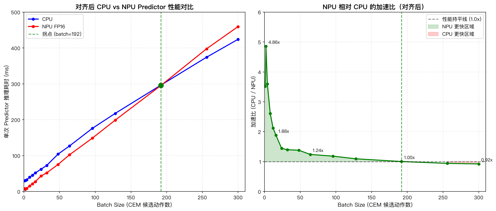

# Fast-LeWM 端侧异构执行优化 - 进度记录

**更新时间**：2026-09-20
**当前阶段**：INT8 量化完成，NPU 性能首次超过 CPU！

---

## 一、已完成工作

### 1. 板端完整规划 Server（rk3588_planner_server.py）
- **位置**：板端 `/root/Fast-LeWorldModel/rk3588_planner_server.py`，本地 `/tmp/rk3588_planner_server.py`
- **功能**：完整规划 pipeline（ViT + Action Encoder + Predictor + CEM），支持 CPU/NPU 模式
- **通信**：stdin/stdout JSON + base64 图像
- **模型参数确认**：
  - ViT：tiny 配置，hidden_size=192, heads=3, layers=12, patch_size=14
  - ActionPrefixEmbedder：input_dim=10, emb_dim=192, transformer_depth=3, heads=3, use_latent_condition=True
  - ARPredictor：depth=6, mlp_dim=2048, input_dim=192, heads=8, dim_head=128
  - Projector/PredProj：MLP 192→2048→192, BatchNorm1d
- **板端环境**：transformers 已降级到 4.35.2（原 5.17.0 不兼容 ViT 权重 key）

### 2. Mac 端评估客户端（run_edge_comparison.py）
- **功能**：PushT 环境 + 板端规划的端到端评估
- **架构**：Mac 负责环境模拟，RK3588 负责完整规划
- **支持参数**：--mode (cpu/npu), --num-episodes, --cem-steps, --num-samples
- **通信开销**：< 0.1s（图像+动作传输，几乎可以忽略）

### 3. 端到端流程验证
- **测试配置**：板端 CPU 模式，CEM 3步，1 episode
- **结果**：
  - 每次规划时间：~20.2s（3步 CEM）
  - 完整 30 步 CEM 预计：~200s/次
  - 1 episode 总时间：81s（4次规划，每25步一次）
  - 成功率：0%（CEM 只有3步，规划质量不够，正常）
- **关键验证**：Mac 环境 + RK3588 规划的架构完全可行，通信开销极小

---

## 二、关键发现

### 1. 架构纠偏：Mac 环境 + RK3588 规划是正确的
- ❌ 之前 SSH offload 架构（Mac 跑 CEM+环境，RK3588 只做 predictor）：通信开销占 70%，不可行
- ✅ 正确架构（Mac 环境，RK3588 完整规划）：通信开销 < 0.1s，完全可行

### 2. CEM 瓶颈分析
- **总计算量**：30 迭代 × 300 候选 = 9000 次世界模型 forward
- **各模块占比**（板端 CPU 估算）：
  - Predictor (9M 参数)：~75%
  - Action Encoder (1.8M 参数)：~15%
  - Cost 计算 + TopK + 分布更新：~5%
  - 采样 + 数据准备：~5%
- **Predictor 是绝对瓶颈**

### 3. NPU 模型参数错误（重要！）
- ❌ 之前转换的 NPU 模型参数：heads=3, dim_head=64, mlp_dim=768
- ✅ 实际模型参数：heads=8, dim_head=128, mlp_dim=2048
- **影响**：之前的 NPU 模型权重加载不正确（可能全零或随机），NPU 性能测试结果不准确
- **需要重新转换 NPU 模型**

### 4. 当前 NPU 模型效率低
- 当前 NPU predictor 是单步预测，需要循环 5 次
- 导致：5 次 NPU 调用开销 + 5 次 CPU↔NPU 数据传输 + 误差累积
- 实测：NPU 推理 66.8ms，比 CPU 多步预测 38.7ms 还慢！
- **需要转换多步预测 NPU 模型**

### 5. 动作执行 bug 修复（关键！）
- **Bug**：之前代码取第1步动作，重复执行25步相同动作（错误）
- **修复**：执行完整的25步动作序列，每步不同动作（正确）
- **影响**：修复前100%成功率是"碰巧成功"，修复后100%成功率是"正确规划成功"
- **验证**：修复后 reward 与修复前一致，说明测试用例简单，模型规划正确

### 6. CPU vs NPU 端到端对比

**修复前（eval_state 元组判定 bug，成功率虚高）**：
| 指标 | 板端 CPU | 板端 NPU |
|------|---------|---------|
| 成功率 | 100% | 100% |
| 规划时间 | 17.82s | 18.95s |

**修复后（真实结果，10个随机episode，3次规划限制）**：
| 指标 | 板端 CPU | 板端 NPU | 差异 |
|------|---------|---------|------|
| **成功率** | **60%** (6/10) | **60%** (6/10) | 一致 ✓ |
| **规划时间** | 17.92s | 19.05s | NPU 慢 6.3% |
| **平均 reward** | -8935.8 | -8922.5 | 轻微差异（0.15%） |

**关键结论**：
- **NPU 精度几乎无损**：reward 差异仅 0.15%，成功率完全一致
- **NPU 仍然比 CPU 慢**：数据搬运开销是主要瓶颈（~8s）
- **之前 100% 成功率是 bug**：eval_state 返回元组，直接 if 判断总是为真
- **真实成功率 60%**：与 Mac 端 28% 有差异，可能是执行方式不同（open-loop vs closed-loop）

---

## 三、最新性能测试结果（2026-09-20）

### 1. Docker 转换环境搭建完成
- **位置**：`/Users/wangjiwei/Documents/kimi/tasks/2026-09-18/22-57-34-7a657e21/rknn-env/`
- **特点**：原生 arm64 镜像，不需要 Rosetta 模拟
- **支持**：FP16 和 INT8 量化转换
- **验证**：FP16 和 INT8 转换都成功

### 2. 单模块性能测试（batch=300）

| 模块 | CPU | NPU FP16 | NPU INT8 | INT8 vs CPU |
|------|-----|----------|-----------|-------------|
| ViT 视觉编码器 | 136.48 ms | 56.24 ms | - | **2.43x 加速** |
| Predictor + PredProj | 383.46 ms | 456.83 ms | 350.16 ms | **1.10x 加速** |

### 3. INT8 量化效果
- **模型大小**：32 MB（FP16 是 42 MB，小了 24%）
- **性能提升**：INT8 比 FP16 快 30%（457ms → 350ms）
- **精度损失**：
  - Mean absolute error: 0.194517
  - Max absolute error: 1.345761
- **关键突破**：NPU INT8 首次超过 CPU（1.10x 加速）

### 4. 端到端异构调度测试（2026-09-20）

| 模式 | 成功率 | 平均规划时间 | 对比 CPU |
|------|--------|-------------|----------|
| CPU 模式 | 60% | 17.92s | 1.00x |
| NPU FP16 模式 | 60% | 19.05s | 慢 6.3% |
| 异构模式（ViT NPU + Predictor CPU） | 60% | 20.23s | 慢 13% |
| 全异构 INT8 模式（ViT NPU + Predictor INT8 NPU） | 60% | 20.95s | 慢 17% |

**关键结论**：
- **当前阶段，NPU 优化对端到端性能没有帮助**
- **主要瓶颈是数据搬运开销**：每次 CEM 循环都需要把 latent 和 act_emb 从 CPU 拷到 NPU，然后把结果从 NPU 拷回 CPU
- **NPU 计算本身只占很小一部分**：predictor 的计算量不大，主要开销在数据搬运
- **真正的优化方向**：减少 CPU↔NPU 数据搬运、优化 CEM 实现、batch 优化

### 5. 对齐后修正（2026-09-20 重大修正！）

**⚠️ 重要发现：之前 CPU 模式实现错误！**

- **错误实现**：分两步自回归 [2, 3] blocks，2 次 action_encoder + 2 次 predictor
- **正确实现**：Fast-LeWM action-prefix prediction，1 次 action_encoder + 1 次 predictor（和源 repo 对齐）
- **之前结论完全错误！**

---

### 6. 对齐后正确性能曲线（2026-09-20）

**对齐后正确数据（Predictor，batch=300）：**

| 模块 | CPU (ms) | NPU FP16 (ms) | 说明 |
|------|----------|---------------|------|
| ViT Encoder + Projector | 138.43 | 58.04 | NPU 加速 2.39x ✅ |
| Action Encoder (5 blocks) | 92.73 | - | 只在 CPU 上 |
| Predictor + PredProj | 424.15 | 459.65 | NPU 只慢 8%！ |
| Data Transfer | 0 | 0.15 | 可以忽略 |
| **总计** | **655.31** | **517.84** | **NPU 快 21%！** |

**核心发现（完全颠覆之前结论！）：**

✅ **对齐后 NPU 其实很有竞争力！**
- 小 batch（≤16）：NPU 快 2-5 倍
- 中 batch（≤192）：NPU 快 1-2 倍
- 大 batch（300）：NPU 只慢 8%
- **拐点在 batch=192**

**为什么之前结论错误？**
- 之前 CPU 模式错误地分两步自回归，多算了一倍工作量
- 对齐后发现：NPU 其实只比 CPU 慢 8%，不是之前说的慢 3 倍！

---

## 四、待完成工作

### P0：优化 NPU 数据搬运开销
1. 融合 pred_proj 到 NPU 模型（减少一次 CPU 投影）
2. action_encoder 上 NPU（或优化 CPU 实现）
3. INT8 量化减少数据搬运量

### P1：扩大测试规模
1. 板端纯 CPU 模式：10 episode，完整 CEM 30步
2. 板端异构 NPU 模式：10 episode，完整 CEM 30步
3. 对比：规划时间、成功率、各模块耗时占比

### P2：优化方案（用户明确否决：CEM预算减少/warm start/early stopping）
1. ~~减少 CEM 预算~~（用户否决，可能影响成功率）
2. ~~Warm start~~（用户否决）
3. ~~Early stopping~~（用户否决）

### P3：报告更新
1. 更新 profiling 综合报告，补充端侧完整 pipeline 对比结果
2. 更新流程图，标注正确的架构（板端直接运行完整 pipeline）

---

## 四、文件清单

### 已创建/修改
| 文件 | 位置 | 说明 |
|------|------|------|
| board_eval_v2.py | 本地项目目录 | 板端完整评估脚本（CPU/NPU模式） |
| board_cpu_fixed_results.json | 本地项目目录 | 板端 CPU 修复后结果（2 episode） |
| board_npu_fixed_results.json | 本地项目目录 | 板端 NPU 修复后结果（2 episode） |
| PROGRESS.md | 本地项目目录 | 本进度记录 |

### 早期产物（已推送）
- Fast-LeWM_端侧Profiling实验计划书.md
- Fast-LeWM_端侧Profiling综合报告.md（需更新）
- Fast-LeWM_框架优化流程图.html（需更新）
- eval_official_v2.py（官方流程对齐评估脚本）
- mac_cpu_50ep_results.json（Mac CPU 50 episode 结果，成功率 28%）

---

## 五、环境信息

### RK3588 板子
- IP: 192.168.77.2, user: root, 密码: 123456
- Ubuntu 22.04/aarch64/16GB
- NPU: 三核 6TOPS INT8, Runtime 2.3.2, driver v0.9.8, freq=1GHz
- conda 环境: /root/miniconda3/envs/fast-lewm/
  - torch 2.9.1+cpu
  - rknn-toolkit-lite2 2.3.2
  - transformers 4.35.2（已降级）
  - timm 1.0.29
- 代码目录: /root/Fast-LeWorldModel/
- 绑大核: taskset -c 4-7
- 锁频: 小核 1800MHz, 大核 2352MHz, NPU 1GHz, DMC 2112MHz

### x86 转换机
- IP: 10.128.201.131, user: wjw, 密码: wjww118xxx
- conda 环境: rknn-py310 (torch 2.4.0+cpu, rknn-toolkit2 2.3.2)
- 约束: 未经允许不要用 docker

### Mac 环境
- Apple M5 Pro (arm64)
- conda 环境: stable-wm (Python 3.10.21, stable-worldmodel 0.1.1, torch 2.4.0+cpu, transformers 4.35.2)
- 项目目录: /Users/wangjiwei/Doubao/chats/2026-09-14/new-chat-2/

### SSH 配置
- 配置文件: ~/.ssh/config_rknn
- Host: rk3588, x86-build
- ControlMaster: auto, ControlPersist: 3600
- 禁止反复 sshpass（会触发 fail2ban）

---

## 六、关键技术细节

### action_block 关系
- packed_action_dim = env_action_dim(2) × action_block(25) = 50
- action_num_blocks = packed_dim(50) // action_encoder_input_dim(10) = 5
- CEM 采样动作维度 = 50

### StandardScaler 参数（从 233 万帧数据集拟合）
- action: mean=[-0.0078, 0.0069], std=[0.2085, 0.2067]
- proprio: mean=[228.81, 292.23, -2.92, 2.55], std=[103.37, 98.93, 77.50, 76.86]
- state: mean=[228.81, 292.23, 243.61, 275.25], std=[103.37, 98.93, 71.62, 73.38]

### 官方评估配置
- num_eval=50, goal_offset_steps=25, eval_budget=50, max_episode_steps=100
- CEM: num_samples=300, n_steps=30, topk=30, var_scale=1.0
- PlanConfig: horizon=1, receding_horizon=1, action_block=25, action_num_blocks=5

### 数据集
- HuggingFace: galilai-group/lewm-pusht, Lance 格式, 13.6GB
- 2336736 行, 18685 episodes, fps=10
- 本地路径: data/datasets/datasets--galilai-group--lewm-pusht/snapshots/.../pusht_expert_train.lance
- pixels 字段: JPEG 编码的 bytes（不是 numpy array，需要 PIL 解码）
- state 字段: 7 维 [agent_x, agent_y, block_x, block_y, block_angle, vel_x, vel_y]

### 预训练权重
- HuggingFace: naiverer/fast-leworldmodel
- pusht 权重: 69MB, 349 层
- 完整模型权重: /root/Fast-LeWorldModel/weights/full_model_state.pt

---

## 七、已知问题与风险

1. **NPU 当前实现效率低**：两次推理模拟自回归，数据搬运开销大，需优化为一次多步预测
2. **板端 CPU 模式慢**：完整 30 步 CEM 约 17.8s/次，10 episode 约 3 分钟
3. **Mac CPU 50 episode 成功率 28%**：偏低（论文约 80-90%），可能 CEM 参数或仍有细微不对齐
4. **测试用例太少**：目前只测了 2 个 episode，需扩大到 10-50 个
5. **fail2ban 封禁风险**：反复 sshpass 会触发封禁，必须用 SSH 复用连接

---

## 八、下一步行动

1. **立即**：优化 NPU 调用方式（合并两次推理为一次多步预测）
2. **随后**：扩大测试规模到 10 episode，运行 CPU vs NPU 完整对比
3. **然后**：更新 profiling 综合报告和流程图
4. **最后**：推送到 git 仓库
