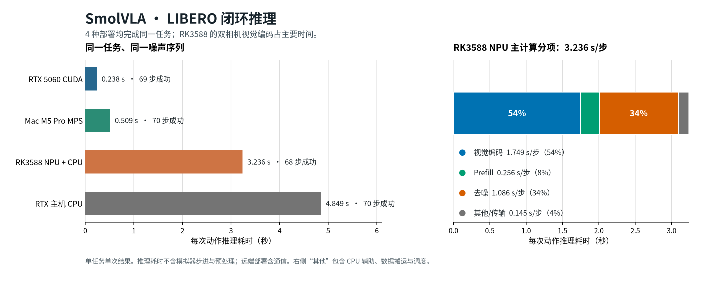
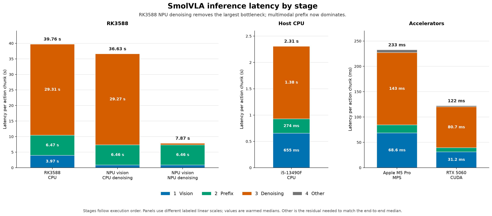
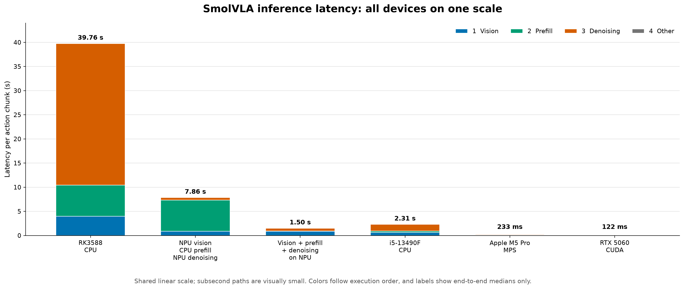
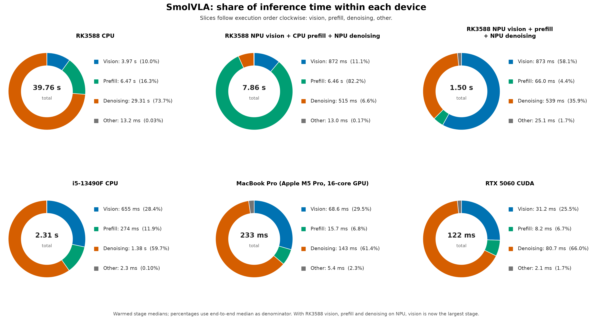

# RK3588 上的 Fast-LeWM 与 SmolVLA

本仓库研究两种不同的端侧机器人推理负载：Fast-LeWM 的 PushT 世界模型与 CEM 规划，以及 SmolVLA 的 LIBERO 视觉语言动作推理。两者的模型、任务和计时口径不同，不能直接用同一个“batch 优化”结论概括。

## 当前结论

### Fast-LeWM：异构规划确实有效，但仍有规划停顿

实现已对齐原论文的终端潜变量代价、预训练权重的注意力分组、最终精英均值选择，以及**一次规划后执行完整 25 个动作**的节奏。RK3588 上的已验证映射是：ViT 与投影走 NPU，动作前缀编码走四个 Cortex-A76 大核，终端 Predictor 与投影走 NPU。固定 300 候选、30 轮 CEM 的完整规划由纯 CPU 的约 **4.47 秒**降至 CPU/NPU 的约 **2.63 秒**；这是每次重规划的等待时间，不是每个动作的闭环延迟。

同一批 50 个 PushT 样本上的后续结果如下。分级候选数保持 30 轮优化，CPU/NPU 协同则在一轮中并行分配候选动作的编码工作。

| RK3588 配置 | 成功样本 | 平均每次重规划 |
|---|---:|---:|
| 纯 CPU，固定 300 候选 | 43/50 | 4504 ms |
| CPU/NPU，固定 300 候选 | 42/50 | 2652 ms |
| CPU/NPU，候选数 `300 → 150 → 64` | 44/50 | 1675 ms |
| 上一项加候选级 CPU/NPU 协同 | **44/50** | **1566 ms** |


动作编码器也曾完整转换到 RKNN，并修复了注意力输出投影的转换误差；但其 batch-300 延迟约 **130 ms**，仍慢于四核 CPU 的约 **67 ms**。因此“不把所有算子都放上 NPU”是实测选择，而非转换失败。分级候选数和协同方案的 50 样本结果不能证明跨任务的成功率不下降。更激进的 iCEM、图形状对齐和动态停止也做过验证：其中基于代价进展的 20/30 轮动态规则在独立 400 样本确认集上未复现早期优势，不能作为当前推荐方案。


**为何早期结论曾认为 NPU 不快？** 旧图把五个未来潜变量都预测出来，却只用最后一个计算 CEM 终端代价；同时预训练权重的注意力头分组没有对齐。修正后，CPU 与 NPU 比较的是同一个终端预测问题。动作编码器曾出现的约 4.9%“异构变慢”也不是可靠的 NPU 干扰结论：服务只绑了四个 A76 核，PyTorch 却建了八个工作线程；改为四线程后，同进程对照差异约 0.17%。

`300 → 150 → 64` 调度保留 30 轮 CEM 更新，把实际候选评估数从 9000 降至 5140，并与现有固定形状 RKNN 图对齐。它改变了搜索预算，不能仅凭动作余弦相似度保证任务质量。完整 NPU 动作编码图虽达到约 `0.999993` 的输出余弦相似度，但 300 候选时仍慢于 CPU；RK3588 自带 Mali GPU 在已测试系统中也没有可用的 OpenCL/Vulkan 计算设备，因此不属于已验证路径。

**已停止的 CEM 调参方向。** iCEM 的 200 样本实验在更低平均延迟下出现少量成功数差异，但没有建立稳健的质量优势。基于预测代价进展决定是否从 20 轮延长到 30 轮的规则，在独立的 600 样本合并验证中是 `512/600`，固定 25 轮是 `514/600`；其平均重规划耗时为 838 对 874 ms，但 P95 反而为 **1045 对 937 ms**。因此不能把这条动态停止规则写成已成立的论文贡献，也不应继续在相同样本上调阈值。相关原始记录保留在 [`results/`](results/)。

### SmolVLA：LIBERO 闭环已跑通，RK 视觉仍是瓶颈

这里使用适配 LIBERO 的 `HuggingFaceVLA/smolvla_libero`，不是下文的 `smolvla_base` 合成输入测试。评测端在每一步生成**完全相同的动作噪声张量**，四种部署都完成了同一 `libero_spatial` 任务 0、初始状态 0、种子 1000 的闭环回合：

| 部署 | 成功所需动作数 | 平均推理耗时/动作 |
|---|---:|---:|
| RTX 主机 CPU | 70 | 4.849 s |
| RTX 5060 CUDA | 69 | **0.238 s** |
| Mac M5 Pro MPS | 70 | 0.509 s |
| RK3588：NPU 主网络 + CPU 辅助 | 68 | 3.236 s |

**推理耗时不含输入预处理、动作后处理和模拟器步进**；远端部署的推理耗时包含请求序列化和网络传输。每种部署只跑了一个完整回合，不能据此比较成功率或精度。原先各设备自行生成噪声时，成功步数为 70–80；对齐噪声后收敛到 68–70，剩余差异尚不能单独归因于精度。



RK3588 把两路图像编码、32 层 Prefill，以及 32 层动作专家与输出投影交给 NPU，但语言/状态/动作嵌入、掩码与 K/V 缓存整理、去噪循环更新仍由 CPU 完成，**不是纯 NPU 部署**。在该闭环回合中，双相机视觉编码约占推理耗时的 **54%**；3.236 s/动作虽能完成模拟任务，尚不足以视为响应式实体机器人控制。图中“其他/传输”是 CPU 辅助、搬运与调度的合计残差，不能全部归为 CPU 算子耗时。完整协议、图转换精度和原始数据见 [LIBERO 闭环评测](docs/smolvla_libero_closed_loop.md)。

### 合成输入阶段剖析：不要与 LIBERO 混用

以下三张较早的图使用的是 **`lerobot/smolvla_base`、合成输入、单相机、16 层动作专家**，用于看设备与算子分工；它们**不是 LIBERO 任务成功率或上述 32 层任务模型的耗时图**。该模型的 RK3588 NPU 视觉 + Prefill + 去噪路径约为 **1.503 s/次动作块**，但不应与 LIBERO 闭环的 3.236 s/动作直接比较。详细配置和原始数据见 [SmolVLA RKNN 阶段剖析](docs/smolvla_rknn.md)。

| `smolvla_base` 合成输入路径 | 完整动作块推理中位数 |
|---|---:|
| RK3588 四核 CPU | 39.759 s |
| RK3588：NPU 视觉 + CPU Prefill + NPU 去噪 | 7.856 s |
| RK3588：NPU 视觉 + NPU Prefill + NPU 去噪 | **1.503 s** |
| i5-13490F CPU | 2.309 s |
| Mac M5 Pro MPS | 0.233 s |
| RTX 5060 CUDA | 0.122 s |

907 MB 的 `smolvla_base` 权重可装入 RK3588 的 16 GiB 共享内存，但未优化的纯 CPU 路径远不能用于交互控制。上述数字只检验合成输入的推理与资源使用，不代表 LIBERO 任务能力。







## 下一步研究

| 优先级 | 方向 | 首个可验证问题 |
|---|---|---|
| 1 | **SmolVLA 视觉与数据路径** | 分别量两路相机编码、格式转换和搬运；图融合或布局调整是否在相同噪声、完整任务下仍保持动作质量并降低延迟？ |
| 2 | **Fast-LeWM 的形状感知 CPU/NPU 调度** | 在已验证的 `300/150/64` 和候选级协同之上，能否用显式的图填充、调度与热状态代价模型，得到跨负载可解释的分配规则？避免继续在同一数据上调动态停止阈值。 |
| 3 | 视觉压缩 | 图像 token、相机选择或剪枝能减少多少耗时与内存？必须在多个种子和任务上检验质量，而不只看余弦相似度。 |
| 4 | 端云协同 | 先比较完整模型远端推理与少数有依据的模型切分，再计入图像/K/V 传输、网络抖动、控制期限和端侧回退；目前**没有**经验证的分布式加速结论。 |

当前先推进 **1，再推进 2**。SmolVLA 在本任务中是单观测、逐动作推理；Fast-LeWM 的 CEM 候选 batch 优化不能直接搬到 SmolVLA。若要声称方法具有普适性，还需要独立任务、设备和热状态下的重复评测。

## 设备与复现

- [机器交接文档](docs/test_hosts.md)：RK3588、RTX 主机与 Mac 的连接方式、运行环境、模型与 RKNN 图路径，以及相同噪声的完整重跑顺序。
- [SmolVLA LIBERO 评测脚本](scripts/eval_smolvla_libero.py)：`--matched-noise` 使用评测端的独立 CPU 随机数生成器；[四组闭环原始记录](results/smolvla_libero/)位于 `matched_*_full.json`。
- [Fast-LeWM 原始计时](results/latest_benchmark.json)、[候选级协同任务结果](results/pusht_dataset_board_npu_hybrid_tiered_50.json)和 [研究计划](RESEARCH_PLAN.md)保留了具体实验口径。
- [LIBERO 图表脚本](scripts/plot_smolvla_libero_summary.py)读取上述闭环 JSON；[合成输入图表脚本](scripts/plot_smolvla_stage_comparison.py)读取 `results/smolvla_profile_*.json`。两组图的数据源不能互换。

在已配置的 Mac 环境中重画图：

```sh
PY="$HOME/.cache/fast-lewm-smolvla-venv/bin/python"
MPLBACKEND=Agg "$PY" scripts/plot_smolvla_libero_summary.py
MPLBACKEND=Agg "$PY" scripts/plot_breakdown.py
MPLBACKEND=Agg "$PY" scripts/plot_hardware_icem.py
```

已部署 Fast-LeWM 权重与固定形状 RKNN 图的 RK3588 上，可按下面的命令启动规划服务；导出、转换与评测脚本位于 [`Fast-LeWorldModel/`](Fast-LeWorldModel/) 和仓库根目录。重跑前应先核对图文件、RKNN Runtime 版本及数据集。

```sh
ssh -F ~/.ssh/config_rknn rk3588 \
  'cd /root/Fast-LeWorldModel && taskset -c 4-7 \
   /root/miniconda3/envs/fast-lewm/bin/python -u rk3588_planner_server.py \
   --mode npu --cem-steps 30 --num-samples 300 \
   --candidate-schedule 300x10,150x10,64x10'
```

所有任务成功数均限于所写明的数据集与回合数，模拟器成功不能代替实机时延与安全性验证。
