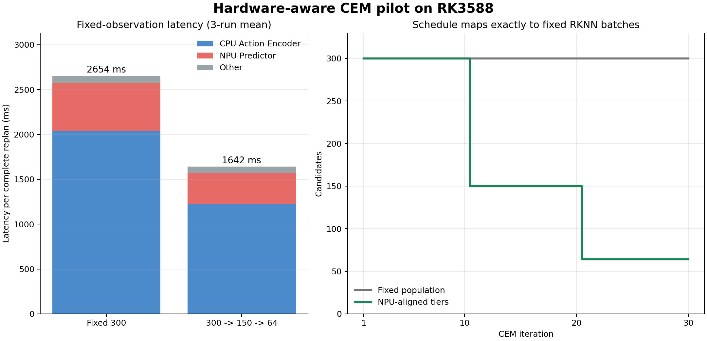

# Fast-LeWM on RK3588

Fast-LeWM PushT planning on RK3588 with a paper-aligned terminal-only CEM rollout and heterogeneous CPU/NPU execution.

## SmolVLA Closed-Loop Task Check

Unlike the synthetic `smolvla_base` inference measurements below, this test
uses a LIBERO-compatible SmolVLA checkpoint and actually feeds actions back
to a LIBERO simulator. On the same `libero_spatial` task 0 and initial state,
RTX 5060 CUDA succeeded in 76 steps (21.3 s episode wall time) and remote
Mac M5 Pro MPS succeeded in 80 steps (43.2 s wall time); the RTX host CPU
also succeeded in 70 steps (345.3 s wall time). These are **one episode per deployment**, not
success-rate estimates. With newly exported task-shaped 32-layer NPU graphs,
RK3588 also **completed the task** in 70 steps (230.3 s episode wall time,
3.24 s/inference). Episode wall time includes simulator stepping and is not
the inference-performance metric.
RK3588 CPU and NPU-vision/CPU hybrid both completed real closed-loop steps,
but full episodes were not completed: matched single-step inference took 65.2 s
and 59.0 s, respectively. The successful RK configuration runs vision,
prefill, and denoising on NPU, but token/state/action embeddings, cache
handling, denoising-loop updates, and preprocessing still run on CPU. It is
**not a pure-NPU result**. This configuration is a large improvement over
those partial paths, but is still too slow for responsive control; its two
vision encoders consume 54% of inference time. The older base-model full-NPU
graphs cannot be used for this LIBERO task because the prompt, image count,
expert width, and layer count differ. Protocol, raw results, and limitations are in
[the closed-loop evaluation report](docs/smolvla_libero_closed_loop.md).

A follow-up with the **same per-step action-noise tensors** on all devices
completed in 70 steps on RTX CPU, 69 on RTX CUDA, 70 on Mac MPS, and 68 on RK
NPU-main-network execution. All four succeeded; the previous 70--80-step
spread was largely confounded by device-specific random streams. This is one
episode per device, not a precision or success-rate ranking. Simulator time
is excluded from the inference figures.

## SmolVLA Base Inference Smoke

As a possible next model, the official `lerobot/smolvla_base` checkpoint was
run through the complete image + language + state to action-chunk inference
path. It produces finite `[1, 50, 6]` actions with the checkpoint's 10
denoising steps. The input is a deterministic synthetic 256x256 image and a
short instruction, so this **only checks execution and resource use**, not
robot-task quality or accuracy after conversion.

| Device | Complete inference, first / next two | Peak process RSS | Accelerator allocation |
|---|---:|---:|---:|
| Mac MPS | 0.395 / 0.227, 0.226 s | 2.92 GB | MPS driver 1.67 GB |
| RK3588, four Cortex-A76 CPU cores and four PyTorch threads | 38.048 / 38.112, 38.155 s | 2.53 GB | None |
| i5-13490F, ten PyTorch CPU threads | 2.316 / 2.676, 2.292 s | 2.95 GB | None |
| RTX 5060 CUDA | 0.463 / 0.120, 0.120 s | 3.23 GB | CUDA reserved 1.31 GB |

The 907 MB checkpoint fits in the RK3588's 16 GB shared memory, but this
unoptimized full-CPU path is far too slow for interactive control. These
figures do not establish NPU compatibility or a distributed-inference gain.
The RTX 5060 run used PyTorch 2.10.0+cu128 on the 8 GB card; its four warm
inferences were `0.120, 0.120, 0.120, 0.121 s`. Total device memory in use
after inference was 1.70 GB, including the host's roughly 0.21 GB idle GPU
usage. The same host's ten-thread CPU reference was 2.3--2.7 s, so CUDA is
clearly useful for this model; this does not yet measure a split across hosts.
The smoke uses LeRobot 0.4.4. The board's four PyTorch threads are matched
to the four pinned A76 cores; its default eight threads took about 40.8 s.
Reproduce with [scripts/smoke_smolvla.py](scripts/smoke_smolvla.py); raw
records are in [results/smolvla_mac_mps_smoke.json](results/smolvla_mac_mps_smoke.json)
and [results/smolvla_rk3588_cpu_smoke.json](results/smolvla_rk3588_cpu_smoke.json),
with the GPU-host records in
[results/smolvla_rtx5060_cuda_smoke.json](results/smolvla_rtx5060_cuda_smoke.json)
and [results/smolvla_rtx5060_host_cpu_smoke.json](results/smolvla_rtx5060_host_cpu_smoke.json).
Available test machines are listed in [docs/test_hosts.md](docs/test_hosts.md).

### RK3588 NPU Vision, Prefill, And Denoising

The SmolVLA vision encoder plus connector was exported as one static FP16
RKNN graph (`[1,3,512,512] -> [1,64,960]`, 227 MB). The original SmolVLM
position-index logic produced an ONNX graph rejected by RKNN's ONNX Runtime;
for fully valid fixed-size images, a precomputed position-index buffer is
mathematically identical (maximum PyTorch output difference: zero) and
converts successfully with RKNN Toolkit2 2.3.2.

The original denoising RKNN graph was inaccurate because its constant Boolean
attention-mask `Where` did not suppress masked logits on RK3588. Replacing it
with an equivalent FP16-safe additive mask fixed the discrepancy: the full
16-layer denoising step now has `0.999987` cosine and `0.0044` MAE versus
the original PyTorch output, at **43.0 ms** NPU median. The original masked
graph had `0.9556` cosine and `0.200` MAE even after fixing cache layout.

In the current matched-input, fixed-noise, 10-step stage profile on RK3588:

| Path | Prefill | Complete 50-action inference |
|---|---:|---:|
| CPU | 6.469 s | 39.759 s |
| NPU vision + CPU prefill + NPU denoising | 6.457 s | 7.856 s |
| NPU vision + NPU prefill + NPU denoising | **66.0 ms** | **1.503 s** |

The NPU prefill is **98x faster** than the otherwise identical CPU prefill;
the complete path is **5.23x faster** than that hybrid and **26.5x faster**
than RK3588 pure CPU. All 32 K/V outputs were checked against PyTorch on two
different synthetic images; the lowest per-output cosine was `0.99999790`.
Holding NPU vision and denoising fixed, the final action cosine was
`0.9999826` (MAE `0.00334`) on the original input and `0.9999665`
(MAE `0.00468`) on the inverted-image input. Preprocessing and embeddings
still run on CPU, so this is not fully NPU-resident SmolVLA. The fixed-shape
graphs assume 70 valid prefill tokens and are not yet general across prompts.
These are deterministic smoke tests, **not task-success or policy-equivalence evidence**.
Reproduction and raw data are in [docs/smolvla_rknn.md](docs/smolvla_rknn.md).

A [matched cross-device stage breakdown](docs/smolvla_rknn.md#matched-cross-device-stage-profile)
compares RK3588 CPU/NPU, i5 CPU, Mac MPS, and RTX 5060 CUDA, including final
action cosine similarity against the i5 CPU reference. With prefill also on
NPU, vision becomes the largest RK3588 stage at about 58% of 1.50 s. The
[stacked latency chart](figures/smolvla_stage_latency_stacked.png),
the [single-scale comparison](figures/smolvla_stage_latency_all_devices.png),
and the [2x3 stage-share chart](figures/smolvla_stage_share_donuts.png) show all
six device/configuration paths in inference order. The Mac reference is a
MacBook Pro with Apple M5 Pro (16-core GPU).

An [RK3588 vla.cpp pilot](docs/vla_cpp_pilot.md) converted the same
checkpoint and ran its ARM CPU backend. Its BF16 full path took about 75--78 s,
so it does not beat even the previous 7.87 s RKNN hybrid. On matched inputs, its
full-path action cosine was only 0.948 versus PyTorch; supplying the exact
PyTorch vision embedding raised it to 0.999991, isolating the main difference
to the vla.cpp vision path. Its prefill stage was slightly faster than
PyTorch's, but the cache cannot yet be handed to the existing RKNN denoising
graph without a new, validated bridge.

## Current Result


Tested on RK3588 with four Cortex-A76 cores pinned, three-core NPU, RKNN Runtime 2.3.2, driver 0.9.8, and the official pretrained PushT checkpoint.

| Metric | CPU | CPU + NPU FP16 | Result |
|---|---:|---:|---:|
| Complete CEM solve per replan (25-action plan) | 4.47 s | 2.63 s | **1.70x speedup** |
| Compute time per executed action (amortized) | 179 ms | 105 ms | **1.70x speedup** |
| Image encoding | 142 ms | 47 ms | **NPU ViT + projector** |
| Action-prefix encoder | 2.009 s | 2.012 s | effectively identical |
| Terminal predictor + projection | 2.29 s | 541 ms | **4.23x contribution speedup** |

Workload: `300` candidates, `30` CEM iterations, `top-k=30`, five action blocks, one terminal latent per candidate, and 25 primitive actions executed before the next replan. Complete-solve stages are means of five repeated requests. The amortized value divides one replan by 25; it is not per-action feedback latency. Raw measurements are in [results/latest_benchmark.json](results/latest_benchmark.json).

The isolated terminal predictor benchmark is:

| Backend | Batch 300 latency |
|---|---:|
| CPU | 118.70 ms |
| NPU FP16 | 17.05 ms |
| Speedup | **6.96x** |

FP16 output agreement against PyTorch: cosine similarity `0.999993`, MAE `0.00150`, maximum absolute error `0.01130`.

## Main Conclusion

The earlier conclusion that RK3588 NPU was no faster than CPU was caused by an implementation mismatch. The old graph predicted all five future latent tokens and discarded the first four when computing the CEM terminal cost. It also instantiated pretrained weights with incorrect head groupings.

An apparent later result of `0/5` PushT successes was also an evaluation mismatch, not model failure. The official protocol initializes from an expert-dataset state and uses the state 25 expert steps later as the goal; the temporary host harness instead used a random environment reset and its unrelated default goal. The official Mac PyTorch evaluation reaches `44/50` (**88%**) on the downloaded PushT evaluation split.

The corrected planning path is:

```text
five action blocks
  -> official action-prefix encoder (6 heads x 32)
  -> terminal prefix token [B, 1, 192]
  -> official predictor (16 value heads x 64)
  -> pred_proj
  -> terminal latent cost
```

With this alignment, NPU runs the fused `ViT + projector` and fused terminal `predictor + pred_proj`. With PyTorch workers matched to the four pinned CPU cores, this reduces a complete `300 x 30` CEM solve from 4.47 seconds to about 2.65 seconds. NPU acceleration is therefore effective, but the CPU action-prefix encoder is now the dominant bottleneck at roughly 77% of heterogeneous solve time. The paper-aligned controller executes all 25 planned actions before replanning, so this is a per-replan planning pause, not a per-action latency. This configuration is not high-frequency closed-loop control, and deployment viability depends on whether the replan pause is acceptable or can be overlapped with execution.

The deployed CEM now also matches the official solver's selection semantics: it executes the final iteration's elite mean rather than the lowest-cost individual sample seen across all iterations, and it uses the official seed `42` with a persistent random generator. On an identical observation, Mac official PyTorch and the reconstructed CPU planner match exactly; RK3588 CPU differs by at most `1.9e-6` after 30 iterations.

## Why Action Encoding Is Slightly Slower

The earlier heterogeneous result appeared `4.90%` slower in Action Encoder, but a controlled same-process experiment disproved NPU interference as the main cause. The service was pinned to four Cortex-A76 cores while PyTorch created eight workers, making separate benchmark processes sensitive to scheduler state.

With four PyTorch workers, five complete requests measure `2008.92 ms` on CPU and `2012.31 ms` in the heterogeneous path, a difference of only `0.17%`. In the isolated experiment, NumPy conversion added `0.10%`, a real NPU Predictor between Action Encoder calls added `0.17%`, and a matched sleep control changed `-0.32%`. CPU and NPU frequencies remained locked at `2.352 GHz` and `1.0 GHz`. The earlier gap was therefore a thread oversubscription and cross-process measurement artifact, not meaningful transfer, frequency, or NPU contention overhead.

## Full-NPU Baseline

A full-NPU comparison is conceptually useful because it exposes whether moving a small or poorly supported operator graph to NPU helps end-to-end latency. Layer-wise bisection found an RKNN Toolkit2 miscompile in the multi-head `Transpose/Reshape + Linear` attention-output pattern. Replacing that mathematically equivalent Linear with a `1x1 Conv` restores batch-300 agreement: cosine similarity `0.999993`, MAE `0.003288`, and maximum absolute error `0.022090`.

The accurate NPU Action Encoder is not selected because it takes about `130 ms` per batch, versus about `67 ms` on the four-core CPU path. The current best verified mapping therefore remains NPU `ViT + projector`, CPU Action Encoder, and NPU `predictor + pred_proj`. The current batch-300 RKNN is about `194 MB` despite a `6.94 MB` ONNX graph, so a more complete convolutional rewrite remains a possible follow-up.

The micro-batch sweep keeps all `300` CEM candidates unchanged, so it does not reduce search quality. Processing the same candidates takes `372.17/162.88/163.59/160.19/151.19/130.28/129.74 ms` for RKNN batches `1/16/32/64/100/150/300`; every configuration has cosine similarity `0.999992`. Batch 300 is already fastest, so splitting the graph does not close the gap to the tuned CPU implementation.

RK3588 includes a Mali-G610 GPU with OpenCL capability, but the tested board image currently exposes no usable compute device: `clinfo` reports zero devices and Vulkan instance creation fails. GPU evaluation requires a kernel-compatible Mali `libmali`/OpenCL or working Panfrost/PanVK stack, followed by a separate MNN, ncnn, or custom OpenCL implementation. It is not part of the verified runtime path.

The paper reports `8.0 s` dynamics time and `28.3 s` full CEM time on an NVIDIA RTX 4090. Those absolute numbers are not directly comparable with this single-environment RK3588 run. This repository reports complete-solve and per-module timing explicitly to avoid mixing one CEM iteration with a full 30-iteration solve.

## Adaptive CEM Experiment

The planner now contains opt-in warm-start and adaptive-stopping experiments, but neither is enabled in the reported benchmark. An alignment audit found that the PushT configuration packs `25` primitive actions into one planning step (`horizon=1`, `action_block=25`, `receding_horizon=1`) and executes the complete 25-action plan before replanning. Therefore, the paper-aligned controller has no unexecuted suffix to shift into the next solve: conventional receding-horizon warm-start does not apply without changing the controller to replan every 1--5 primitive actions.

The conservative adaptive rule monitors best-cost improvement, distribution-mean motion, and RMS standard deviation. In the deterministic seed-42 smoke test, both paper-aligned replans used all 30 iterations, producing the same actions and costs as fixed CEM. Measured planning latency was `2.64 s` versus `2.62 s` per replan, i.e. no useful improvement. These two-run smoke-test records are in `results/adaptive_cem_aligned_pilot_seed42.json` and `results/fixed_cem_aligned_pilot_seed42.json`; they are implementation checks, not task-success evidence.

Warm-start remains available for an explicitly changed MPC cadence through `--replan_every < 25`, and the server reports whether it was actually applied, how many iterations ran, and why optimization stopped. Any such configuration must be evaluated separately for task success because it is no longer the paper's open-loop 25-action execution policy.

## Hardware-Aware Population Schedule



The next experiment keeps all 30 CEM updates but maps their candidate populations to three fixed RKNN graphs: `300 x 10`, `150 x 10`, then `64 x 10`. This is deliberately hardware-aware: every iteration fills one compiled NPU batch instead of padding an arbitrary population to batch 300.

On the same fixed observation and deterministic seed, the schedule reduced a complete replan from `2654 ms` to `1642 ms` (**38.1%**) and reduced evaluated candidates from `9000` to `5140`. Action Encoder time fell from `2037 ms` to `1226 ms`; NPU Predictor time fell from `538 ms` to `343 ms`.

Reusing 30% of the previous iteration's elites reduced CPU evaluations to `4879`, but the NPU still executed `5140` padded graph slots and total latency only improved from `1642 ms` to `1590 ms`. Its action deviation was also larger, so elite reuse is implemented as an opt-in experiment and is not recommended as the current default.

The three Predictor graphs have consistent FP16 agreement (cosine similarity `0.9999934`--`0.9999937`). Median NPU latency is `5.18/9.48/16.87 ms` for batch `64/150/300`. One batch-150 run had an `80.4 ms` outlier, while its p95 remained `9.56 ms`; medians and p95 are therefore reported alongside means.

The aligned 50-case dataset evaluation gives:

| Backend / population | Success | Mean replan latency |
|---|---:|---:|
| Mac original PyTorch, official solver stream | 44/50 (88%) | not compared across hardware |
| RK3588 CPU, fixed 300 | 43/50 (86%) | 4504 ms |
| RK3588 CPU + NPU, fixed 300 | 42/50 (84%) | 2652 ms |
| RK3588 CPU + NPU, `300 -> 150 -> 64` | 44/50 (88%) | **1675 ms** |

The board CPU/NPU runs use the same 50 dataset rows and reset the candidate generator identically for each episode. Fixed NPU differs from CPU on only three cases (two losses and one gain), so the net `1/50` gap is not evidence of a systematic regression. Small FP16 errors do alter CEM top-k membership and can amplify across 30 iterations, but the task-level result shows no broad failure. The tiered schedule matches the Mac original's observed `88%` while reducing fixed-NPU latency another `36.8%`; larger trials are still needed for a tight confidence interval.

## Candidate-Level CPU/NPU Coexecution Pilot

The full NPU Action Encoder is slower than the four-core CPU encoder, but the
independent candidates within one CEM iteration can be divided between them.
An opt-in `npu-hybrid-action` mode sends 100 of 300 candidates, or 64 of 150
candidates, to a fixed-shape NPU Action Encoder while the CPU processes the
remainder. Batch 64 remains on CPU. The two output slices are concatenated
before the existing NPU predictor runs; CEM iterations themselves remain
sequential.

On a fixed observation, five repeated complete replans decreased from
`2653` to `2257 ms` for fixed 300 and from `1663` to `1500 ms` for the tiered
population schedule. The latter is the relevant comparison with the current
fastest baseline. The isolated 300-candidate Action Encoder plus predictor
benchmark decreased from `92.94` to `71.68 ms` median at the 200-CPU/100-NPU
split. These are measured wall times, not a sum of device utilization times.

On the same 50 PushT dataset rows, tiered NPU with CPU-only Action Encoder
scored `44/50` at `1675 ms` mean replan latency; hybrid Action Encoder also
scored `44/50` at `1566 ms` (a `6.5%` incremental latency reduction). One
previously successful row failed and one previously failed row succeeded, so
the equal aggregate is not an exact behavior match or a success-preservation
claim. These measurements are in `results/hybrid_action_benchmark.json`,
`results/hybrid_planner_baseline_observation.json`,
`results/hybrid_planner_coexecution_observation.json`, and
`results/pusht_dataset_board_npu_hybrid_tiered_50.json`.

## iCEM Baseline and CEM Decision

The board has an opt-in `--planner-algorithm icem` baseline. It adapts the
original iCEM mechanisms to the paper's packed 25-action plan: exponentially
decaying population, temporally correlated noise across the 25 primitive
actions, within-solve elite injection, momentum updates, bounded actions, and
best-seen action selection. It does **not** shift elites across replans because
the entire 25-action plan is executed before another solve. The installed
`stable-worldmodel` iCEM class is not used directly: it has no population
decay, and its colored noise would degenerate on this task's packed
`horizon=1` representation.

All methods below use the same 200 dataset rows, the same hybrid CPU/NPU
action mapping and NPU image/predictor graphs, and 30 optimizer rounds.
Two full runs were made for the first two methods; the second runs had
stable within-run latency. The graph-snap pilot was run once between them:

| Planner | Success, runs 1 / 2 | Mean replan, runs 1 / 2 | P95, run 2 | Candidates |
|---|---:|---:|---:|---:|
| Tiered CEM, `300x10,150x10,64x10` | 183 / 182 | 2033 / 1499 ms | 1570 ms | 5140 |
| iCEM, decay `1.25` | 179 / 178 | 1404 / 1006 ms | 1077 ms | 2562 |
| iCEM, decay `1.25`, graph-snap | 181 / not run | 994 / not run ms | 1066 ms | 2650 |
| iCEM, decay `1.05` | 178 / not run | 2335 / not run ms | not measured | 4700 |

On the second full runs, iCEM `1.25` was 33% faster than tiered CEM with
four fewer successes. Paired discordance was 16 tiered-only versus 12
iCEM-only successes, insufficient to establish a success difference or
equivalence. Graph-snap rounds the virtual iCEM population to the nearest
available RKNN batch (`64`, `150`, `300`). It filled 2650/2650 predictor
slots instead of ordinary iCEM's 2562/3122, yet improved mean replan latency
by only about 1% against the repeat run. Its 181/200 successes versus
ordinary iCEM's 178/200 is a small pilot difference, not a demonstrated
quality gain. The `1.05` configuration was close to the tiered schedule in a
short fixed-observation run (`1551` vs `1500 ms`), but did not remain
latency-matched in its only sustained run.

The fixed RKNN graph sizes explain part of this mismatch: decay `1.05`
evaluated 4700 real candidates but occupied 6600 predictor graph slots,
whereas the tiered schedule filled 5140 slots with 5140 candidates. The first
full runs slowed sharply (tiered CEM's first/last 30 replans: 1509/2253 ms),
but the repeats did not (1496/1499 ms for tiered CEM and 1003/1009 ms for
iCEM). The board reached about 84 C and A76 frequency was observed at
2.208 GHz during load, versus nominal 2.352 GHz. Thermal state is a plausible
contributor, not an isolated cause: run order, device load, and frequency
were not controlled enough to attribute the first-run slowdown precisely.

A 50-row, same-schedule ablation using population decay without iCEM's other
mechanisms reached 42/50 versus 44/50 for iCEM, both near 1.0 s per replan.
This pilot cannot attribute a task-level gain to any one iCEM mechanism.

### Final CEM allocation gate

On the initial 200 rows, fixed iCEM budgets of 10, 15, 20, and 30 rounds
reached 169, 173, 179, and 177 successes respectively, at mean replanning
latencies of 487, 612, 744, and 987 ms. The 30-round figure comes from the
trace-collection run; separate 30-round repeats varied by one or two cases.
This is a useful latency-quality sweep, not evidence that 20 rounds is
universally optimal.

We then tested one *locked* quality-aware rule: run 20 rounds, and extend to
30 only when the best predicted cost improved by more than 15% from round 15
to round 20. This threshold was chosen after inspecting the initial rows, so
only subsequent disjoint rows count as validation. The rule was tested
against fixed 20, 25, and 30 rounds on 200 new rows (seed 43); a further 400
new rows (seed 45) compared the adaptive rule with the closest-budget fixed
25-round baseline. All use the same model, 25-action execution cadence,
hybrid mapping, and paired dataset rows within each comparison.

| Rows | Fixed 20 | Fixed 25 | Fixed 30 | Adaptive 20/30 |
|---|---:|---:|---:|---:|
| 200 holdout: successes | 177 | 173 | 178 | 180 |
| 200 holdout: mean replan | 747 ms | 883 ms | 996 ms | 832 ms |
| 400 confirmation: successes | not run | 341 | not run | 332 |
| 400 confirmation: mean replan | not run | 869 ms | not run | 841 ms |

The apparent 200-row advantage over fixed 25 rounds **did not replicate**:
the adaptive rule lost 9 successes in the next 400 rows. Combined across the
600 disjoint validation rows, adaptive versus fixed 25 is 512/600 versus
514/600, with 15 adaptive-only and 17 fixed-only successes. Adaptive mean
replan latency is 838 versus 874 ms, but its P95 is **1045 versus 937 ms**.
The varying number of replans per episode means these latency aggregates are
per request, not matched per episode. The rule extended 272 of 736 planning
requests across the two runs. Energy was not measured.

**Decision:** stop treating population decay, graph snapping, or this
cost-progress-based extension as a paper-level CEM contribution. iCEM is a
useful deployment baseline, but neither the static graph-aligned variant nor
the dynamic rule improves the quality-latency-tail frontier robustly. Further
CEM threshold tuning on these rows would be overfitting; any new CEM claim
would require a different mechanism and independent tasks/devices.

## Correctness Fixes

- Terminal-only predictor input and output are fixed at `[300, 1, 192]`.
- `pred_proj` is fused into the RKNN graph.
- Action-prefix configuration is restored to `6 x 32`.
- Predictor configuration is restored to `16 x 64`.
- Expanded latents are made contiguous before the action encoder.
- CPU and NPU paths use the same terminal cost semantics.
- Action attention output projection uses an RKNN-safe `1x1 Conv` equivalent.
- NPU handles in `board_eval_v2.py` are correctly shared with `get_cost()`.
- Planner command-line CEM iteration and sample settings now take effect.
- Host evaluation follows the paper's 25-action execution cadence by default.
- CEM sampling is deterministically seeded per replan for paired comparisons.

## Repository Layout

```text
Fast-LeWorldModel/                  Official model source and deployment artifacts
  config/                           Official training/evaluation configuration
  weights/                          Official pretrained PushT checkpoint
  onnx_out/                         Terminal predictor ONNX
  predictor_terminal_*.rknn         Terminal predictor RKNN FP16
  vit_encoder_projected_*.rknn      Fused ViT/projector RKNN FP16
  export_terminal_predictor.py      Checkpoint -> aligned terminal ONNX
  export_action_encoder.py          Experimental terminal Action Encoder export
  export_action_bisection.py        Cumulative layer accuracy bisection export
  export_vit_encoder.py             Checkpoint -> fused ViT/projector ONNX
  convert_to_rknn.py                ONNX -> RKNN conversion
results/latest_benchmark.json       Latest raw measurements
results/hardware_icem_fixed_observation.json  Paired schedule pilot
results/predictor_batch_scan.json   Fixed-RKNN batch latency and accuracy
results/mac_original_pusht_50.json          Official Mac PyTorch success run
results/pusht_dataset_board_cpu_50.json       Aligned board CPU success run
results/pusht_dataset_board_npu_50.json       Aligned fixed-NPU success run
results/pusht_dataset_board_npu_tiered_50.json Aligned tiered-NPU run
results/original_cpu_vs_rknn.json   Exact CPU and NPU planner parity audit
results/hybrid_action_benchmark.json Candidate-level coexecution microbenchmark
results/pusht_dataset_board_npu_hybrid_tiered_50.json Hybrid task-level pilot
results/pusht_dataset_board_cem_tiered_hybrid_200.json 200-case tiered CEM
results/pusht_dataset_board_icem_hybrid_200.json       200-case iCEM decay 1.25
results/pusht_dataset_board_icem_decay105_hybrid_200.json 200-case iCEM decay 1.05
results/pusht_dataset_board_cem_decay_hybrid_50.json 50-case decay-only CEM ablation
results/pusht_dataset_board_cem_tiered_hybrid_200_repeat.json Tiered CEM repeat
results/pusht_dataset_board_icem_hybrid_200_repeat.json       iCEM repeat
results/pusht_dataset_board_icem_graph_snap_hybrid_200.json  Graph-snap pilot
results/pusht_dataset_board_icem_20steps_holdout200.json    Fixed-20 holdout
results/pusht_dataset_board_icem_25steps_holdout200.json    Fixed-25 holdout
results/pusht_dataset_board_icem_30steps_holdout200.json    Fixed-30 holdout
results/pusht_dataset_board_icem_adaptive_holdout200.json   Adaptive holdout
results/pusht_dataset_board_icem_25steps_confirm400.json   Fixed-25 confirmation
results/pusht_dataset_board_icem_adaptive_confirm400.json  Adaptive confirmation
scripts/plot_breakdown.py           Breakdown figure generator
scripts/plot_hardware_icem.py       Hardware-aware schedule figure
scripts/probe_hardware_icem.py      Paired fixed-observation benchmark
scripts/validate_action_encoder_board.py  Board-side RKNN accuracy gate
scripts/validate_vit_board.py       Board-side ViT/projector accuracy gate
scripts/diagnose_action_slowdown_board.py  Controlled slowdown isolation
scripts/run_action_bisection_rknn.py       RKNN simulator layer comparison
scripts/scan_action_microbatch_board.py    Fixed-300-candidate batch sweep
rk3588_planner_server.py            Board-side planner service
board_eval_v2.py                    Board-side official CEM evaluation path
run_pusht_eval_official.py          Host-side evaluation client
breakdown.png                       Latest complete-CEM breakdown
hardware_icem_pilot.png             Experimental schedule result
```

## Reproduction

Export the fused terminal predictor:

```bash
conda run -n stable-wm python Fast-LeWorldModel/export_terminal_predictor.py \
  --checkpoint Fast-LeWorldModel/weights/Fast-lewm_pusht_object.ckpt \
  --outdir Fast-LeWorldModel/onnx_out \
  --batch 300
```

Export the fused image encoder:

```bash
conda run -n stable-wm python Fast-LeWorldModel/export_vit_encoder.py \
  --checkpoint Fast-LeWorldModel/weights/Fast-lewm_pusht_object.ckpt \
  --outdir Fast-LeWorldModel/onnx_out
```

Convert it on the RKNN Toolkit2 Linux environment:

```bash
python Fast-LeWorldModel/convert_to_rknn.py \
  --onnx Fast-LeWorldModel/onnx_out/predictor_terminal_with_proj_b300.onnx \
  --out Fast-LeWorldModel/predictor_terminal_with_proj_b300_fp16.rknn \
  --dtype fp16
```

Deploy and start the board-side planner:

```bash
scp -F ~/.ssh/config_rknn \
  rk3588_planner_server.py \
  Fast-LeWorldModel/predictor_terminal_with_proj_b300_fp16.rknn \
  Fast-LeWorldModel/vit_encoder_projected_fp16.rknn \
  rk3588:/root/Fast-LeWorldModel/

ssh -F ~/.ssh/config_rknn rk3588 \
  'cd /root/Fast-LeWorldModel && taskset -c 4-7 \
   /root/miniconda3/envs/fast-lewm/bin/python -u rk3588_planner_server.py \
   --mode npu --cem-steps 30 --num-samples 300 \
   --candidate-schedule 300x10,150x10,64x10'
```

Regenerate the chart:

```bash
python scripts/plot_breakdown.py
python scripts/plot_hardware_icem.py
```

## Remaining Work

The prioritized research gates and first operator-level board profile are in
[RESEARCH_PLAN.md](RESEARCH_PLAN.md).

1. Expand the aligned dataset evaluation beyond 50 cases and report paired confidence intervals.
2. Optimize or replace the CPU action-prefix encoder, now the dominant latency component.
3. Build INT8 only with real latent/action-prefix calibration data and revalidate candidate ranking and task success.
