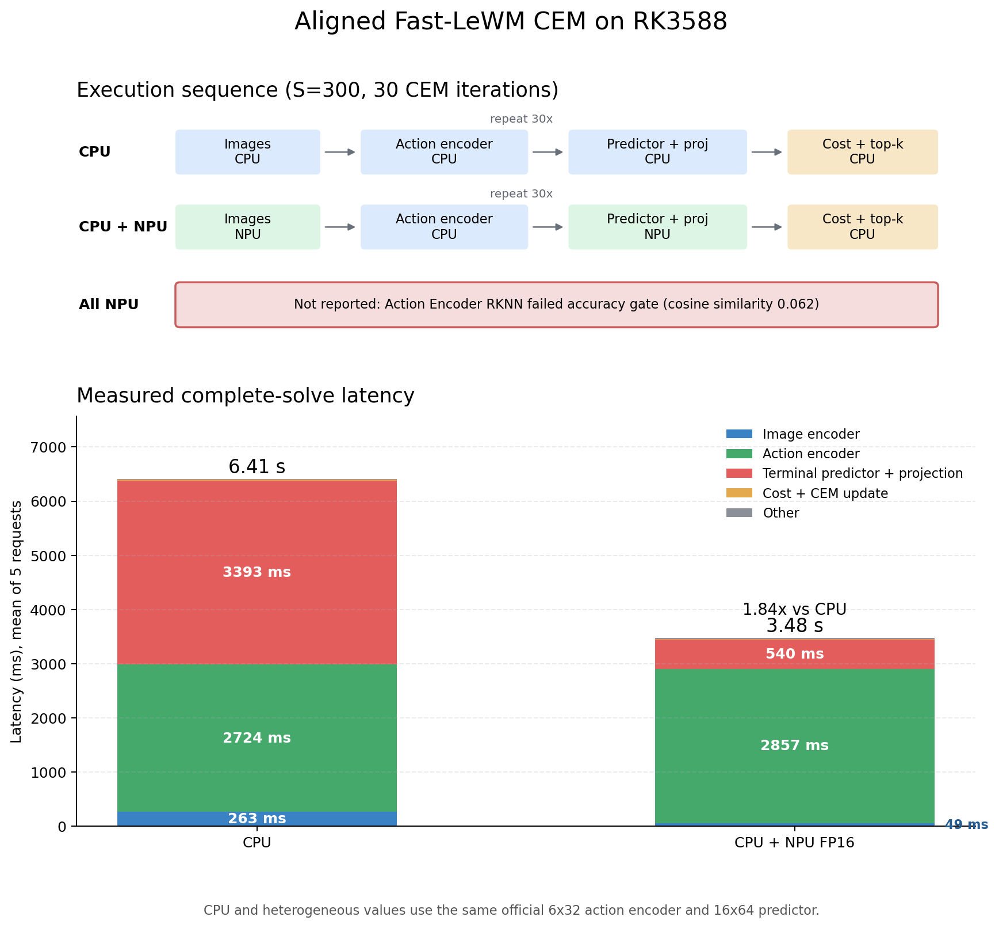

# Fast-LeWM on RK3588

Fast-LeWM PushT planning on RK3588 with a paper-aligned terminal-only CEM rollout and heterogeneous CPU/NPU execution.

## Current Result



Tested on RK3588 with four Cortex-A76 cores pinned, three-core NPU, RKNN Runtime 2.3.2, driver 0.9.8, and the official pretrained PushT checkpoint.

| Metric | CPU | CPU + NPU FP16 | Result |
|---|---:|---:|---:|
| Complete CEM solve | 4.47 s | 2.63 s | **1.70x speedup** |
| Image encoding | 142 ms | 47 ms | **NPU ViT + projector** |
| Action-prefix encoder | 2.009 s | 2.012 s | effectively identical |
| Terminal predictor + projection | 2.29 s | 541 ms | **4.23x contribution speedup** |

Workload: `300` candidates, `30` CEM iterations, `top-k=30`, five action blocks, one terminal latent per candidate. Complete-solve stages are means of five repeated requests. Raw measurements are in [results/latest_benchmark.json](results/latest_benchmark.json).

The isolated terminal predictor benchmark is:

| Backend | Batch 300 latency |
|---|---:|
| CPU | 118.70 ms |
| NPU FP16 | 17.05 ms |
| Speedup | **6.96x** |

FP16 output agreement against PyTorch: cosine similarity `0.999993`, MAE `0.00150`, maximum absolute error `0.01130`.

## Main Conclusion

The earlier conclusion that RK3588 NPU was no faster than CPU was caused by an implementation mismatch. The old graph predicted all five future latent tokens and discarded the first four when computing the CEM terminal cost. It also instantiated pretrained weights with incorrect head groupings.

The corrected planning path is:

```text
five action blocks
  -> official action-prefix encoder (6 heads x 32)
  -> terminal prefix token [B, 1, 192]
  -> official predictor (16 value heads x 64)
  -> pred_proj
  -> terminal latent cost
```

With this alignment, NPU runs the fused `ViT + projector` and fused terminal `predictor + pred_proj`. With PyTorch workers matched to the four pinned CPU cores, this reduces a complete `300 x 30` CEM solve from 4.47 seconds to 2.63 seconds (`1.70x`). NPU acceleration is therefore effective, but the CPU action-prefix encoder is now the dominant bottleneck at roughly 77% of heterogeneous solve time. The current configuration is still not suitable for high-frequency closed-loop control without further planning-budget or action-encoder optimization.

## Why Action Encoding Is Slightly Slower

The earlier heterogeneous result appeared `4.90%` slower in Action Encoder, but a controlled same-process experiment disproved NPU interference as the main cause. The service was pinned to four Cortex-A76 cores while PyTorch created eight workers, making separate benchmark processes sensitive to scheduler state.

With four PyTorch workers, five complete requests measure `2008.92 ms` on CPU and `2012.31 ms` in the heterogeneous path, a difference of only `0.17%`. In the isolated experiment, NumPy conversion added `0.10%`, a real NPU Predictor between Action Encoder calls added `0.17%`, and a matched sleep control changed `-0.32%`. CPU and NPU frequencies remained locked at `2.352 GHz` and `1.0 GHz`. The earlier gap was therefore a thread oversubscription and cross-process measurement artifact, not meaningful transfer, frequency, or NPU contention overhead.

## Full-NPU Baseline

A full-NPU comparison is conceptually useful because it exposes whether moving a small or poorly supported operator graph to NPU helps end-to-end latency. Layer-wise bisection found an RKNN Toolkit2 miscompile in the multi-head `Transpose/Reshape + Linear` attention-output pattern. Replacing that mathematically equivalent Linear with a `1x1 Conv` restores batch-300 agreement: cosine similarity `0.999993`, MAE `0.003288`, and maximum absolute error `0.022090`.

The accurate NPU Action Encoder is not selected because it takes about `130 ms` per batch, versus about `67 ms` on the four-core CPU path. The current best verified mapping therefore remains NPU `ViT + projector`, CPU Action Encoder, and NPU `predictor + pred_proj`. The current batch-300 RKNN is about `194 MB` despite a `6.94 MB` ONNX graph, so a more complete convolutional rewrite remains a possible follow-up.

The micro-batch sweep keeps all `300` CEM candidates unchanged, so it does not reduce search quality. Processing the same candidates takes `372.17/162.88/163.59/160.19/151.19/130.28/129.74 ms` for RKNN batches `1/16/32/64/100/150/300`; every configuration has cosine similarity `0.999992`. Batch 300 is already fastest, so splitting the graph does not close the gap to the tuned CPU implementation.

RK3588 includes a Mali-G610 GPU with OpenCL capability, but the tested board image currently exposes no usable compute device: `clinfo` reports zero devices and Vulkan instance creation fails. GPU evaluation requires a kernel-compatible Mali `libmali`/OpenCL or working Panfrost/PanVK stack, followed by a separate MNN, ncnn, or custom OpenCL implementation. It is not part of the verified runtime path.

The paper reports `8.0 s` dynamics time and `28.3 s` full CEM time on an NVIDIA RTX 4090. Those absolute numbers are not directly comparable with this single-environment RK3588 run. This repository reports complete-solve and per-module timing explicitly to avoid mixing one CEM iteration with a full 30-iteration solve.

## Adaptive CEM Experiment

The planner now contains opt-in warm-start and adaptive-stopping experiments, but neither is enabled in the reported benchmark. An alignment audit found that the PushT configuration packs `25` primitive actions into one planning step (`horizon=1`, `action_block=25`, `receding_horizon=1`) and executes the complete 25-action plan before replanning. Therefore, the paper-aligned controller has no unexecuted suffix to shift into the next solve: conventional receding-horizon warm-start does not apply without changing the controller to replan every 1--5 primitive actions.

The conservative adaptive rule monitors best-cost improvement, distribution-mean motion, and RMS standard deviation. In the deterministic seed-42 smoke test, both paper-aligned replans used all 30 iterations, producing the same actions and costs as fixed CEM. Measured planning latency was `2.64 s` versus `2.62 s` per replan, i.e. no useful improvement. These two-run smoke-test records are in `results/adaptive_cem_aligned_pilot_seed42.json` and `results/fixed_cem_aligned_pilot_seed42.json`; they are implementation checks, not task-success evidence.

Warm-start remains available for an explicitly changed MPC cadence through `--replan_every < 25`, and the server reports whether it was actually applied, how many iterations ran, and why optimization stopped. Any such configuration must be evaluated separately for task success because it is no longer the paper's open-loop 25-action execution policy.

## Correctness Fixes

- Terminal-only predictor input and output are fixed at `[300, 1, 192]`.
- `pred_proj` is fused into the RKNN graph.
- Action-prefix configuration is restored to `6 x 32`.
- Predictor configuration is restored to `16 x 64`.
- Expanded latents are made contiguous before the action encoder.
- CPU and NPU paths use the same terminal cost semantics.
- Action attention output projection uses an RKNN-safe `1x1 Conv` equivalent.
- NPU handles in `board_eval_v2.py` are correctly shared with `get_cost()`.
- Planner command-line CEM iteration and sample settings now take effect.
- Host evaluation follows the paper's 25-action execution cadence by default.
- CEM sampling is deterministically seeded per replan for paired comparisons.

## Repository Layout

```text
Fast-LeWorldModel/                  Official model source and deployment artifacts
  config/                           Official training/evaluation configuration
  weights/                          Official pretrained PushT checkpoint
  onnx_out/                         Terminal predictor ONNX
  predictor_terminal_*.rknn         Terminal predictor RKNN FP16
  vit_encoder_projected_*.rknn      Fused ViT/projector RKNN FP16
  export_terminal_predictor.py      Checkpoint -> aligned terminal ONNX
  export_action_encoder.py          Experimental terminal Action Encoder export
  export_action_bisection.py        Cumulative layer accuracy bisection export
  export_vit_encoder.py             Checkpoint -> fused ViT/projector ONNX
  convert_to_rknn.py                ONNX -> RKNN conversion
results/latest_benchmark.json       Latest raw measurements
scripts/plot_breakdown.py           Breakdown figure generator
scripts/validate_action_encoder_board.py  Board-side RKNN accuracy gate
scripts/validate_vit_board.py       Board-side ViT/projector accuracy gate
scripts/diagnose_action_slowdown_board.py  Controlled slowdown isolation
scripts/run_action_bisection_rknn.py       RKNN simulator layer comparison
scripts/scan_action_microbatch_board.py    Fixed-300-candidate batch sweep
rk3588_planner_server.py            Board-side planner service
board_eval_v2.py                    Board-side official CEM evaluation path
run_pusht_eval_official.py          Host-side evaluation client
breakdown.png                       Latest complete-CEM breakdown
```

## Reproduction

Export the fused terminal predictor:

```bash
conda run -n stable-wm python Fast-LeWorldModel/export_terminal_predictor.py \
  --checkpoint Fast-LeWorldModel/weights/Fast-lewm_pusht_object.ckpt \
  --outdir Fast-LeWorldModel/onnx_out \
  --batch 300
```

Export the fused image encoder:

```bash
conda run -n stable-wm python Fast-LeWorldModel/export_vit_encoder.py \
  --checkpoint Fast-LeWorldModel/weights/Fast-lewm_pusht_object.ckpt \
  --outdir Fast-LeWorldModel/onnx_out
```

Convert it on the RKNN Toolkit2 Linux environment:

```bash
python Fast-LeWorldModel/convert_to_rknn.py \
  --onnx Fast-LeWorldModel/onnx_out/predictor_terminal_with_proj_b300.onnx \
  --out Fast-LeWorldModel/predictor_terminal_with_proj_b300_fp16.rknn \
  --dtype fp16
```

Deploy and start the board-side planner:

```bash
scp -F ~/.ssh/config_rknn \
  rk3588_planner_server.py \
  Fast-LeWorldModel/predictor_terminal_with_proj_b300_fp16.rknn \
  Fast-LeWorldModel/vit_encoder_projected_fp16.rknn \
  rk3588:/root/Fast-LeWorldModel/

ssh -F ~/.ssh/config_rknn rk3588 \
  'cd /root/Fast-LeWorldModel && taskset -c 4-7 \
   /root/miniconda3/envs/fast-lewm/bin/python -u rk3588_planner_server.py \
   --mode npu --cem-steps 30 --num-samples 300'
```

Regenerate the chart:

```bash
python scripts/plot_breakdown.py
```

## Remaining Work

1. Run the corrected implementation over the full episode set and report success rate with confidence intervals.
2. Optimize or replace the CPU action-prefix encoder, now the dominant latency component.
3. Build INT8 only with real latent/action-prefix calibration data and revalidate candidate ranking and task success.
