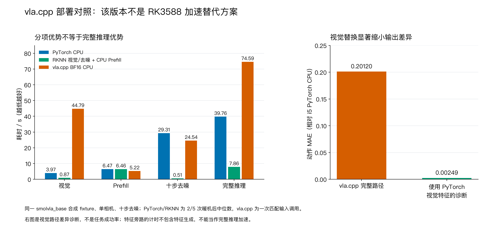
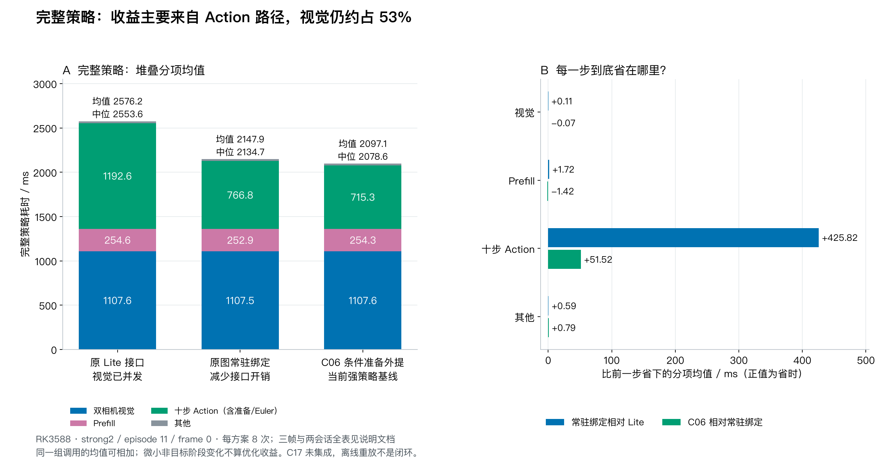
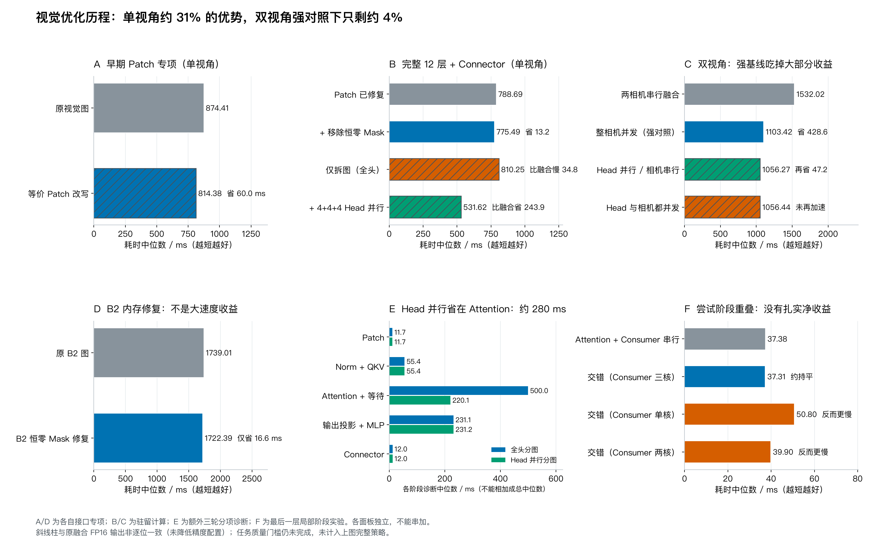
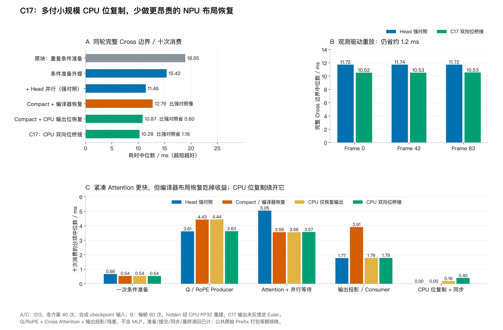

# RK3588 端侧机器人推理实验

本仓库研究 RK3588 上的机器人模型推理，围绕三大块开展实验：**Fast-LeWM 世界模型规划 → vla.cpp 推理框架对照 → SmolVLA 部署与系统优化**。vla.cpp 是推理框架，其测试模型也是 SmolVLA，不是第三种模型。当前研究集中于 SmolVLA；前两块保留为部署积累与替代方案对照，不再继续立题。

## 当前判断与重点

更新于 2026-09-30。**部署与测量基础已经建立，工程优化有效，也发现了有系统意味的局部机制；但尚未形成“重要痛点 → 独特洞察 → 完整收益”闭合的 CCF-A 系统论文主线。** 后续不以增加候选数量或局部加速百分比衡量进展，而以重要路径上的因果证据、强对照净收益和机制适用范围判断。

**当前收敛的工作主线：网络受限时，多视角 SmolVLA 的端侧 NPU 与远端 GPU 怎样分工，才能比优化全端和流式全云更早完成一个完整动作块？** 云算得快但要传观测，端不等网络但算得慢；协作也可能多传更大的特征、多等一次汇合。先证明完整协作的价值，再从真实关键路径挖最小机制，不再由一个局部几何实验牵着项目走。这是待验证路线，不是已成立的新问题或贡献。

- **当前性能起点：** 实际双视角观测的完整策略离线重放约 `2.55 → 2.14 → 2.08 s`，分别对应常驻执行与固定条件准备外提；视觉仍约占 53%，Action 约占 34%。这是同协议的优化链，不是旧闭环时延的直接下降。
- **最值得汇报的发现：** 实际单视角 head 并行快约 32%，在双视角整相机并发强对照下只再快约 6%；并行收益不能简单叠加，具体资源瓶颈仍待定位。CPU 原生位搬运可以胜过 NPU 内部排列恢复，但当前只省约 1.2 ms/观测/单块，不能写成完整策略快 10%。
- **局部机制素材：** 同样 1024 个视觉 token，整段改成二维执行表示会更慢；在归一化后建立编译边界、只改 MLP 表示，末层完整 consumer 约 `18.9 → 15.8–16.0 ms`。但更快路径与原融合数值不同，不能计为无损策略加速。降为限时支撑项，不继续优先扫形状或扩十二层。
- **下一关：** 补匹配输入的远端完整服务与请求时间线，审计协作是否存在真实胜区。实际 PNG 比端侧特征更小，端侧后半程仍约 0.99 s，都是可能否定协作的强反例。未过这一关，不建设调度器，也不预设“卸走一路后最优核配置反转”。

执行顺序与自审见 [主线计划书](docs/MAINLINE_EXECUTION_PLAN_2026-09-30.md)：**完整服务 → 协作可行域 → 关键路径微机制 → 完整系统验证**。本次为规划调整，没有新增性能或质量结果。

这里的“强基线”指**当前已测、需要被新机制击败的优化对照**，不是理论性能上限，也不代表已达到 Roofline 算存平衡。小实现不等于小贡献；但局部机制的巧妙，也不能替代完整路径上的重要性。

## 实验总览

| 实验块 | 要回答的问题 | 关键结论 | 证据范围 |
|---|---|---|---|
| Fast-LeWM / PushT | 世界模型规划应怎样分给 CPU 与 NPU？ | 固定搜索预算下，重规划均值约 4504 → 2652 ms；减少候选后进一步至 1566 ms，但改变了搜索预算。 | 同一批 50 个 PushT 样本；研究方向已收尾。 |
| vla.cpp / RK3588 | 现成 C++ 推理框架能否替代当前部署？ | 测试版本完整 CPU 路径慢、视觉输出差异较大；Prefill 单独更快，不代表整体更快。 | 官方 SmolVLA base、合成输入与精确输入诊断；保留为替代方案审计。 |
| SmolVLA / RKNN | 能否跑通 VLA，并从真实热点继续优化？ | base 合成输入完整推理约 1.503 s；LIBERO 闭环已跑通；近期实际观测离线重放约 2.08 s，剩余视觉约占 53%。 | 当前核心方向；三种不同协议，不能拼成一条累计加速链。 |

## 1. Fast-LeWM：世界模型与 CEM 异构规划

**定位：已完成的前期成果。** 组会可用一页说明异构分工与质量/搜索预算的区别；不再投入候选预算、动态停止或 iCEM 调参。

### 做了什么

使用 Fast-LeWM 的 PushT 预训练世界模型，以 CEM（交叉熵方法）搜索动作。实现对齐原论文的终端潜变量代价、权重的注意力分组、最终精英均值选择，以及**一次规划后执行完整 25 个动作**的节奏。

已验证的执行分工是：图像 ViT 与投影走 NPU，动作前缀编码走四个 Cortex-A76 大核，终端 Predictor 与投影走 NPU，代价计算与 CEM 更新留在 CPU。

### 主要结果

以下是同一批 50 个 PushT 样本的结果；时延为**每次重规划的平均等待时间**，不是每个动作的反馈时延。

| RK3588 配置 | 成功样本 | 平均每次重规划 |
|---|---:|---:|
| 纯 CPU，固定 300 候选、30 轮 CEM | 43/50 | 4504 ms |
| CPU/NPU，固定 300 候选、30 轮 CEM | 42/50 | 2652 ms |
| CPU/NPU，候选数 `300 → 150 → 64`，仍为 30 轮 | 44/50 | 1675 ms |
| 上一项加候选级 CPU/NPU 并行编码 | 44/50 | **1566 ms** |


上图来自独立固定负载计时：完整规划约 4.47 → 2.63 s，与 50 样本表不是同一组调用。除以 25 得到的摊销 ms/action 不等于逐动作闭环时延。


上图是固定观测、三次运行均值的专项实验，不是 50 样本任务评测。分级方案对齐固定形状 RKNN 图，将候选评估数从 9000 降到 5140，因此后半段加速不能归为“等工作量系统优化”。

### 关键结论与负结果

- **异构分工比全部交给 NPU 更合理。** 完整动作编码器虽已转换、校验，但 batch-300 时 NPU 约 130 ms，慢于四核 CPU 的约 67 ms；当前路径选择 CPU 有实测依据。
- **先对齐语义，再比较性能。** 早期图预测五个未来潜变量却只消费最后一个，且注意力分组未对齐；修正后才比较同一个终端预测问题。八线程挤在四个大核上造成的退化，也不能解释成 NPU 干扰。
- **减少搜索预算有质量风险。** 50 个样本的成功数不足以证明跨任务质量不下降；输出余弦相似度也不能替代任务成功率。
- **动态停止未形成稳定优势。** 独立 600 样本合并验证中，动态 20/30 轮为 512/600，固定 25 轮为 514/600；平均重规划 838 vs 874 ms，但 P95 为 1045 vs 937 ms。该调参方向已停止，不作为论文贡献。
- 已测试系统中的 Mali GPU 没有可用的 OpenCL/Vulkan 计算设备，不属于已验证计算路径。

原始记录：[固定负载分解](results/latest_benchmark.json)、[候选级协同 50 样本](results/pusht_dataset_board_npu_hybrid_tiered_50.json)、[研究审查与后续门槛](RESEARCH_PLAN.md)。此方向保留为完成的实验积累，当前不继续以它立题。

## 2. vla.cpp：现成 C++ 推理框架的部署对照

**定位：替代方案审计。** 用于说明为什么不直接换框架，以及如何定位数值差异；适合简要汇报或备份页，不继续以移植、量化适配本身作为研究主线。

### 做了什么

测试 `VinRobotics/vla.cpp` 的 `0644fc62` 版本，将官方 `lerobot/smolvla_base` 转为约 777.3 MiB 的 BF16 GGUF，在 RK3588 上使用四线程 CPU。**该测试版本没有 RKNPU 后端**，所以它不是 NPU 实现与 RKNN 的同设备后端对比。

### 主要结果

下表使用 base 的单相机、十步去噪合成 fixture。PyTorch/RKNN 是暖机后 2/5 次中位数，vla.cpp 是一次精确输入匹配诊断，单位 ms。各阶段中位数不能相加冒充总中位数。

| RK3588 路径 | 视觉 | Prefill | 十步去噪 | 完整推理 |
|---|---:|---:|---:|---:|
| PyTorch 四核 CPU | 3968 | 6469 | 29309 | 39759 |
| RKNN 视觉/去噪 + CPU Prefill | 872 | 6457 | 515 | 7856 |
| vla.cpp BF16 CPU，匹配输入单次 | 44785 | 5216 | 24542 | 74588 |



### 关键结论与负结果

- **Prefill 单独更快，整体却更慢。** vla.cpp 的 CPU Prefill 约 5.22 s，低于 PyTorch 的约 6.47 s，但视觉约 44.79 s，不能直接替代已验证的 RKNN 路径。另一次默认暖机后 3 次调用的总中位数为 78.06 s。
- **视觉路径存在明显输出差异。** 完整动作相对 i5 PyTorch CPU 的余弦为 0.948093、MAE 为 0.20120；送入同一 PyTorch 视觉特征后，余弦升至 0.999991、MAE 降至 0.00249。这支持将主要差异定位到该版本的视觉路径，不代表任务质量已验证。
- **特征旁路不是完整推理加速。** 旁路后约 29.81 s 不包含视觉特征生成，不能与完整推理直接算加速比。
- **Q8 未跑通。** 测试版本拒绝部分视觉、连接器及语言层的量化权重；没有 Q8 时延或质量结论。公开接口也未暴露当前 RKNN 动作图所需的 Prefill K/V，不能直接拼接两套运行时。

结论：保留为 C++ 实现与数值诊断参考，不作为当前加速路线。详见 [vla.cpp 实验协议](docs/vla_cpp_pilot.md) 与[原始记录](results/smolvla_vla_cpp_rk3588_pilot.json)。

## 3. SmolVLA：从部署验证到系统机制探索

**定位：当前核心工作。** 优先阅读完整策略优化、视觉并行和原生位桥接三节；base 部署与早期闭环是基础证据，不等于近期优化已通过闭环验证。

此块分成三种证据：**base 合成输入剖析、LIBERO 在线仿真闭环、实际观测离线重放与局部优化**。模型形状、输入、测量环境不同，不能直接跨表相减。当前研究保持模型、观测、全部 heads/tokens、动作数量与十步去噪，不靠跳帧、剪枝、近似复用或降低目标精度配置加速。

### 3.1 base：跨设备剖析与完整 NPU 主网络部署

使用 `lerobot/smolvla_base`，单相机、16 层动作专家、同一合成图像/指令/状态/初始噪声。RKNN 承担视觉、Prefill（多模态前缀处理）和动作去噪主网络；CPU 仍负责预处理、输入嵌入与去噪循环辅助，**不是纯 NPU 推理**。

| 路径 | 完整动作块推理中位数 |
|---|---:|
| RK3588 四核 CPU | 39.759 s |
| RK3588 NPU 视觉 + CPU Prefill + NPU 去噪 | 7.856 s |
| RK3588 NPU 视觉 + NPU Prefill + NPU 去噪 | **1.503 s** |
| i5-13490F CPU | 2.309 s |
| Mac M5 Pro MPS | 0.233 s |
| RTX 5060 CUDA | 0.122 s |


图的不同面板使用各自标明的线性轴；“其他”是使阶段合计对应总中位数的残差，不全是 CPU 算子。

**关键结论：** Prefill 搬到 NPU 后，该阶段约 6457 → 66 ms，完整路径由 7.856 → 1.503 s，视觉成为约 58% 的剩余热点。这是合成输入性能与数值验证，不是任务成功率；约 907 MB 权重可装入板端内存，也不代表纯 CPU 可用于交互控制。

补充图：[全部设备同轴对比](figures/smolvla_stage_latency_all_devices.png)、[各设备阶段占比](figures/smolvla_stage_share_donuts.png)。详细协议见 [base 阶段剖析](docs/smolvla_rknn.md)。

### 3.2 LIBERO：相同动作噪声下的仿真闭环

使用 `HuggingFaceVLA/smolvla_libero`，双相机、32 层动作专家。四种部署每一步使用完全相同的动作噪声，均完成 `libero_spatial` 任务 0、初始状态 0、种子 1000 的一个完整回合。

| 部署 | 成功所需动作数 | 平均推理耗时/动作 |
|---|---:|---:|
| RTX 主机 CPU | 70 | 4.849 s |
| RTX 5060 CUDA | 69 | **0.238 s** |
| Mac M5 Pro MPS | 70 | 0.509 s |
| RK3588 NPU 主网络 + CPU 辅助 | 68 | 3.236 s |


**关键结论：** RK3588 已跑通闭环，但双相机视觉约占推理时延 54%，3.236 s/动作仍不足以视为响应式实体机器人控制。每种部署只有一个回合，68–70 的动作数差异不能用来排名成功率或精度。

推理计时不含输入预处理、动作后处理和模拟器步进；远端部署包含请求序列化与网络传输。模拟器始终在 RTX 主机，RK3588 只执行策略。base 与 LIBERO 的视觉/连接器权重经核验相同，但 Prefill/动作图不同，不能混用。详见 [闭环协议与数值边界](docs/smolvla_libero_closed_loop.md)。

### 3.3 完整策略优化：常驻原生缓冲区与条件准备外提

实际观测来自固定版本 LIBERO-Spatial 演示数据的一个 episode、三个帧；保留双相机、32 层动作专家和十步依赖 CPU FP32 Euler。每帧各方案固定同一初始噪声，两次独立会话，每帧每方案 8 次。

| 完整策略路径 | 六组“会话 × 帧”的总时延中位数范围 |
|---|---:|
| 原 Lite 动作接口，视觉已做整相机并发 | 2553–2563 ms |
| 原图常驻原生输入/输出绑定，减少重复接口工作 | 2135–2138 ms |
| 再将固定条件准备外提为每观测一次，缓存为消费就绪布局 | **2078–2084 ms** |



**关键结论：** 常驻接口吸收了主要工程开销；条件准备外提相对常驻强对照再降低约 2.43%–2.78% 的完整策略中位数。图的代表帧中，十步 Action 分项均值分别省约 426 ms、52 ms，视觉与 Prefill 基本不变。最终视觉约占 53%，Action 约占 34%。

所有测试步骤的 velocity、FP32 latent 与最终输出逐位一致，比较对象是共享视觉/Prefill 后的原 RKNN 路径，不是 CPU FP32 全模型。**这是离线观测重放，没有新闭环成功率**；计时不含外部预处理、网络、模拟器、动作后处理与图初始化，不能写成此前 3.236 s 闭环直接降到 2.08 s。

独立合成条件的完整 action-flow 专项也测得 747.77/749.43 → 692.65/693.32 ms，约降低 7.4%；一次准备已计入，但不是完整 VLA 的 7.4%。详见 [条件缓存验证](docs/SMOLVLA_CONDITIONING_VALIDATION.md) 和[完整策略重放](docs/SMOLVLA_POLICY_REPLAY_VALIDATION.md)。

### 3.4 视觉优化：原生布局续接与 Head 并行

直接拆 Attention 图会增加布局转换与交接。实验将 head 分区与前后图的 NPU 原生缓冲区布局对齐，让不同核读写同一缓冲区的互不重叠区域，避免 host 上拆分、拼接 Q/K/V。

| 完整视觉路径 | 单视角中位数 | 双视角驻留计算中位数 |
|---|---:|---:|
| Patch / 恒零 Mask 修复后的融合控制 | 775.49 ms | 串行 1532.02 ms |
| 整相机分核并发的融合强对照 | 不适用 | **1103.42 ms** |
| 原生分图，4+4+4 heads 并行 | **531.62 ms** | 相机串行 1056.27 ms |
| 上一项再让两相机 pipeline 并发 | 不适用 | 1056.44 ms |

单视角与双视角来自各自专项，不跨列累计。驻留计算包含图提交/同步，不含输入准备和最终 host 读回。



**关键结论：** 单视角相对融合强基线省约 244 ms（31.4%），但双视角整相机并发已吸收多数收益，head 方案只再省约 47 ms（4.27%）。Attention 专项阶段约 500 → 220 ms，而输出投影/MLP 仍约 231 ms；继续叠加相机并发或跨阶段交错没有扎实净收益，部分方案更慢。

保留的另一负结果是：双相机合批图的恒零 Mask 修复大幅减少 SDK 分配字段，却只将时延 1739.01 → 1722.39 ms，约 0.96%。分配字节不是实测 DDR 流量，忙核百分比也不是 MAC 利用率。

数学等价改写与“不降低精度配置”不保证融合后浮点舍入一致。head 分图相对原融合 FP16 的特征输出非逐位相同，**任务质量门槛未完成，未计入上一节完整策略**。详见 [视觉专项调查](docs/SMOLVLA_VISION_INVESTIGATION.md)。

**2026-09-30 实际输入复验：** 三帧、两个真实记录视角，两次独立会话，每方案每模式八次，测量完整十二层与 connector；以下包含输入原生打包、同步与读回，不含外部 resize/normalize。数字不能与上表旧合成输入/驻留口径跨表相减。

| 实际视觉方案 | 含输入/读回中位数范围 |
|---|---:|
| 单相机融合控制 / head 并行 | 766.43–768.27 / 516.03–518.65 ms |
| 双相机融合整相机并发 | 1102.94–1105.20 ms |
| 双相机 head 并行，相机串行 / 再并发 | 1033.63–1035.12 / 1024.07–1027.68 ms |

单视角收益约 32.4%–32.8%，双视角 head 串行相对融合并发只剩 6.2%–6.3%；再叠相机并发不到 1%。十二层 head/full、交换/恢复审计通过，但分图/融合 connector 仍不同。**这证明优势随分支数变化，不证明最佳配置已经发生切换**，也不是端云胜区。

**新边界实验：同样表示，为什么一处慢、一处快？** `64×16` 不是改相机分辨率，而是把同样 1024 个 token 的 NPU 索引重新分解。整个 consumer 都用它时约 42 ms；归一化保持 flat、单独让 MLP 用它，包含新增调用约 15.8–16.0 ms。原 consumer 约 18.9 ms。前者编译时把 H 变成 batch，后者才保住 B=1 的二维矩阵几何。不拆图、仅在 Norm 后插 reshape 的简单替代也已测：编译后 reshape 被移到 Norm 前，仍慢。


图为一轮独立会话，六张实际图、每方案四十次；柱高概括逐图中位数，细线是其范围，不是置信区间。**更快的拆图路径全部通过 flat split anchor，但未通过原 consumer 逐位门槛**；原 ConvAdd 变为 Conv + Add 是待核查的舍入线索。因此不能乘十二层、不能报完整 VLA 提升，也不放宽数值协议绕过。详见 [本轮执行报告](docs/SMOLVLA_VISION_SERVICE_VALIDATION_2026-09-30.md)及[任务计划书](docs/PLAN_VISION_BOUNDARIES_2026-09-30.md)。

### 3.5 动作 Cross-Attention：CPU/NPU 原生位桥接

动作专家的此处有 15 个 Q heads 共享 5 组 K/V。紧凑执行保留共享 K/V，将同组查询打包以改善 NPU Attention 几何，但这种排列不匹配原来的前后算子；编译器自动恢复会引入额外 reshape/恢复矩阵，改投影权重又会改变浮点累加顺序。

最终机制是：

```text
原 Q/RoPE → CPU 原生存储位打包 → NPU 紧凑 Attention 并行
         → CPU 原生存储位恢复 → 原输出投影 / 残差
```

CPU 仅复制已有 FP16 存储位，不做重新量化或浮点计算；全部 heads、tokens 与输出投影顺序保留。它不是 CPU softmax，也不是已经实现的 CPU/NPU overlap。



**关键结论：** 同轮十次消费，head 并行强对照 11.46 ms，CPU 仅恢复输出 10.87 ms，双向位桥接 10.28 ms；三轮相对 head 控制降低 10.3%–10.7%。新增双向位复制/同步约 0.397 ms，换来更便宜的 Attention 与前后交接，而不是减少模型工作。

512 个合成扰动、30 个观测驱动步骤逐位通过。观测驱动重放仍省约 **1.2 ms/观测/该块十次消费**，但只覆盖一个 Q/RoPE/Attention/输出投影边界，不含 MLP，也未让该实现反馈进完整 Euler 轨迹。**局部 10% 不等于完整 VLA 10%**；尾延迟也非始终改善，暂不机械铺开全部层。

完整数据、阶段拆分与失败消融见 [优化进展图表](docs/SMOLVLA_OPTIMIZATION_PROGRESS.md) 和[原生位桥接续验](docs/SMOLVLA_CROSS_FOLLOWUP_VALIDATION.md)。

### 3.6 无损端云传输：先否定“特征一定更小”

同一批六张实际记录图像，每视角无损 PNG 为 **57–66 KiB**；NPU connector 的既有 FP16 存储经无损 zlib 压缩仍约 **111 KiB**。因此当前输入上“先提特征再上传可省字节”的默认动机不成立。

FP16 表示在此可逐位恢复，是因为这些 NPU 输出本来就用 FP16 存储，不是新降低目标精度；不能推广到任意云端 FP32 特征。目前只完成字节与编解码测量，**没有端云时延胜区或协作加速结论**。详见 [无损 payload 实测](docs/SMOLVLA_POLICY_REPLAY_VALIDATION.md)。

## 研究取舍与组会重点

| 工作 | 当前价值 | 后续决定 |
|---|---|---|
| 完整策略强基线、常驻执行、固定条件缓存 | 工程收益与测量基础扎实，能确定剩余热点 | 保留为统一起点，不反复对较弱接口计算创新收益 |
| 视觉 head 并行与整相机并发对照 | 实际六张图复验，纠正单视角收益外推 | 服务矩阵已完成；完整策略质量仍待测，不盲目增加 overlap |
| 视觉阶段几何与编译边界 | 整段慢、归一化后拆开快；简单单图 reshape 又被编译传播破坏 | 降为限时支撑；先有完整路径上的必要性，未过原数值门槛不扩十二层 |
| CPU/NPU 原生位桥接 | 最有系统意味的局部发现：便宜位搬运可避开昂贵设备内恢复 | 保留为机制线索；不直接铺开全部层，先找重要同因边界 |
| 恒零 Mask 修复与编译分配膨胀定位 | 有因果解释的修复，但速度收益约 1% | 保留为负结果/工程项；未证明容量痛点前不升为主线 |
| 简单跨相机/跨阶段交错 | 已测版本无扎实净收益 | 暂停该版本，不将负结果外推为所有细粒度协作都无效 |
| Fast-LeWM 调参、vla.cpp 继续适配 | 已获得前期结论，偏离当前关键问题 | 收尾；仅在后续机制确有需要时用作对照 |

组会主报告围绕三个问题：**完整策略现在慢在哪里；强全端与流式全云之间是否还有协作空间；普通分工之后究竟还有哪个重要障碍没解决。** 后两项目前缺结果，须作为下一轮计划而非结论。单/双视角并行是动机证据；位桥接、阶段几何与数值失败作为机制附录，不能占据整场汇报。Fast-LeWM 简述前期积累，vla.cpp 与其他失败消融放备份页。

## 后续最关键事项

### 一条主线，四级实验

研究对象是**同一观测的两路视觉独立执行 → 汇合 Prefill → 固定条件下十步依赖动作生成**。V 提供分支并行机会，A 决定不能随意跨步切分。联合考虑执行位置、无损 payload 和端侧并行方式；不是单独做 GEMM 调参，也不是先写一个通用卸载 runtime。

| 优先级 | 要解决的问题 | 必须交付 / 停止条件 |
|---|---|---|
| **P0：完整服务与依赖账本** | 匹配输入下，本地、远端与网络到底各慢多少？ | 补 GPU 分支/完整策略、优化全端与流式全云统一请求计时、依赖时间线；复用已完成本地矩阵，不拿旧 CUDA 闭环数字顶替 |
| **P1：完整协作可行域** | 一端一云、两种汇合位置等合法分工，能否同时胜过两端强控制？ | 预先冻结网络范围，先成本/支配性分析、再真实链路复验；付全 codec/共享链路/后半程成本。理想协作也无胜区则停止，不先建调度器 |
| **P2：关键路径微机制** | 普通放置和最佳静态配置之后，是否还存在重要且非显然的障碍？ | 小型“放置 × 本地配置 × overlap”对照，选择一个真实原因深挖；若静态分工吸收收益，保留工程结果，不强造自适应创新 |
| **P3：完整系统与泛化验证** | 机制是否在完整动作、不同输入和真实网络下仍成立？ | 接完整策略，扩大 episode/指令覆盖，补闭环质量、尾延迟、内存/能耗和热状态；明确获胜与失败范围 |

**现在只优先执行 P0/P1。** P2/P3 依赖前面的证据，不是四条并行路线。全云必须允许逐相机上传/计算重叠；云排队不能凭空假定。当前资源是端侧与近端 GPU，不冒充已测三层端边云。

### 局部探索如何归位

视觉阶段几何降为限时数值归因支撑，先不扩十二层；原生位桥接保留为机制素材，不铺全部动作层。CPU softmax/tile、prefix/首步交错、迁移、hedge 与 flow 投机兼容性暂停，只有完整时间线证明必要且重要才重开。不是认定这些永远无价值，而是不再让小形状决定项目优先级。

### 自审结论

**最大风险：协作可能没有净胜区；第二风险：有胜区也可能只是普通静态卸载。** 特征比图像大、端侧后半程约 0.99 s，可能直接抵消所谓并行优势。现有数据没有证明本地配置赢家反转，也没有证明全端与流式全云之间还留有新机制空间。

因此当前是**有条件继续的工作主线，尚非已成立的 CCF-A 论文方案**。若 P1 被强控制否定，就归档并重新立题，不自动用另一个小探针续故事。数学等价、传输逐位、同后端图改写逐位、跨后端浮点差异和任务质量分别核验；不靠训练、少观测/动作/去噪步或降低目标精度获得收益。

完整动机、任务预算、合法计划族、网络协议、邻近工作与逻辑缺口见 [主线计划书及自审](docs/MAINLINE_EXECUTION_PLAN_2026-09-30.md)。[视觉边界计划](docs/PLAN_VISION_BOUNDARIES_2026-09-30.md)和[旧机制计划](docs/NEXT_MECHANISM_PLAN_2026-09-28.md)保留执行历史，不再定义当前优先级；[候选表](docs/IDEA_CANDIDATES.md)作为证据索引。

## 设备、制品与复现

- [机器与环境交接](docs/test_hosts.md)：RK3588、RTX 主机、Mac，以及完整评测顺序。
- [模型制品备份](docs/artifact_backups.md)：区分 Fast-LeWM、SmolVLA base、SmolVLA LIBERO；大模型/编译图不入 Git，校验清单见 [制品 SHA-256](artifacts/2026-09-24.sha256)。
- [LIBERO 闭环脚本](scripts/eval_smolvla_libero.py)：`--matched-noise` 对齐噪声；[闭环原始数据](results/smolvla_libero/)中的 `matched_*_full.json` 对应任务结果。
- [完整策略与局部原始数据](results/smolvla_libero/policy_replay_probes/)：仅离线重放，不能替代闭环。

在已配置的 Mac 环境重画图，不会重跑性能实验：

```sh
PY="$HOME/.cache/fast-lewm-smolvla-venv/bin/python"
MPLBACKEND=Agg "$PY" scripts/plot_breakdown.py
MPLBACKEND=Agg "$PY" scripts/plot_hardware_icem.py
MPLBACKEND=Agg "$PY" scripts/plot_vla_cpp_summary.py
MPLBACKEND=Agg "$PY" scripts/plot_smolvla_stage_comparison.py
MPLBACKEND=Agg "$PY" scripts/plot_smolvla_libero_summary.py
MPLBACKEND=Agg "$PY" scripts/plot_smolvla_optimization_progress.py
```

已部署 Fast-LeWM 权重与固定形状图的板端，可用以下命令启动规划服务；重跑前核对图文件、Runtime 版本和数据集：

```sh
ssh -F ~/.ssh/config_rknn rk3588 \
  'cd /root/Fast-LeWorldModel && taskset -c 4-7 \
   /root/miniconda3/envs/fast-lewm/bin/python -u rk3588_planner_server.py \
   --mode npu --cem-steps 30 --num-samples 300 \
   --candidate-schedule 300x10,150x10,64x10'
```

所有成功数仅适用于写明的数据集与回合数；模拟器成功不能替代实体机器人时延、质量与安全性验证。
