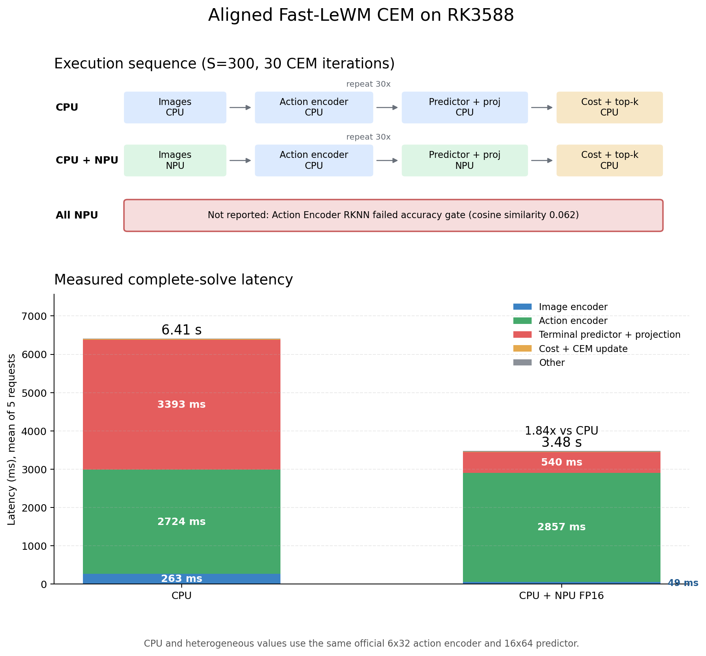
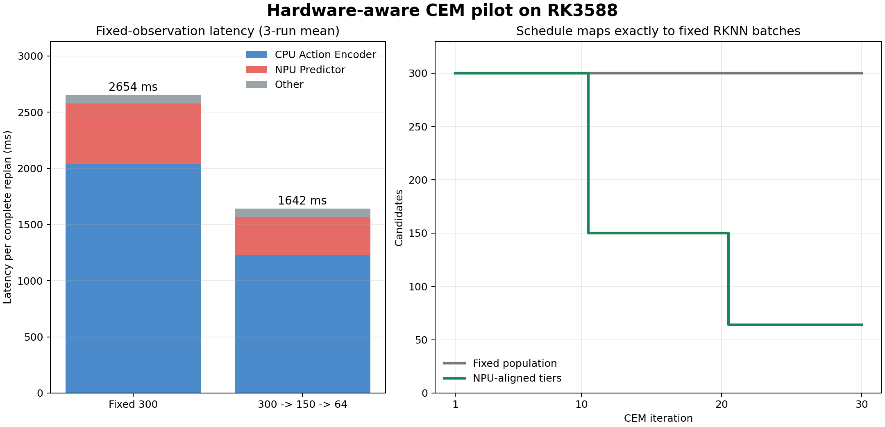
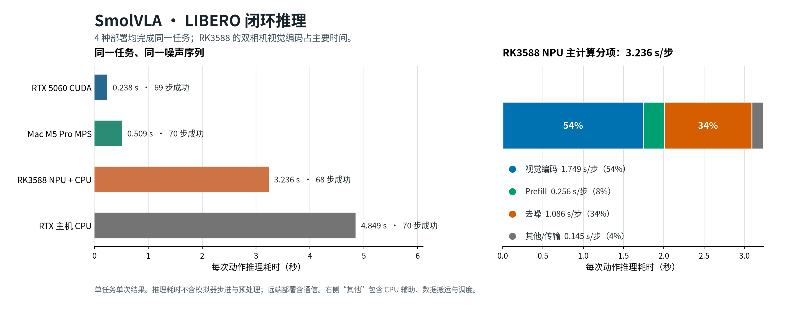
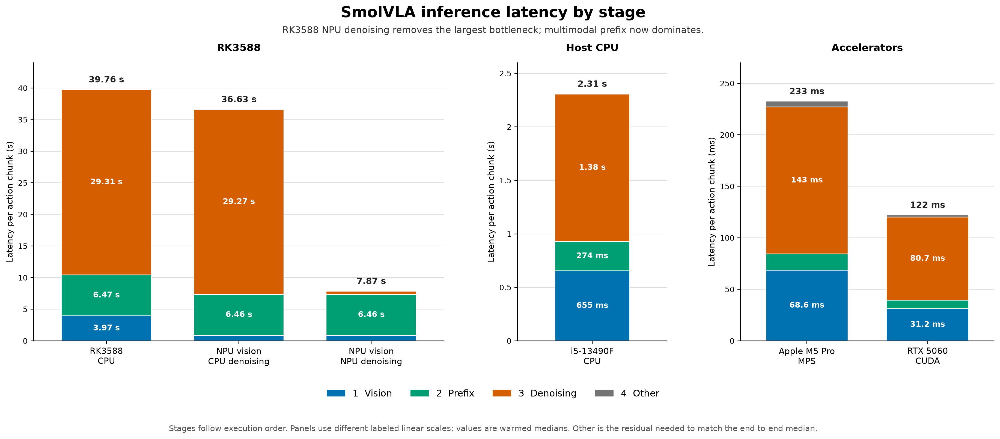
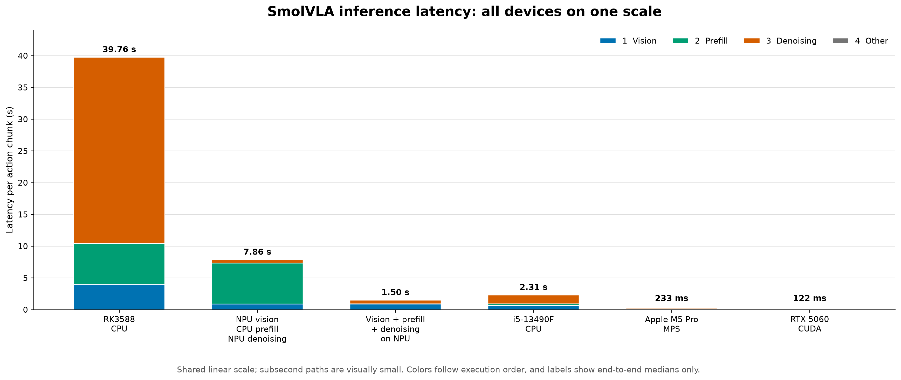
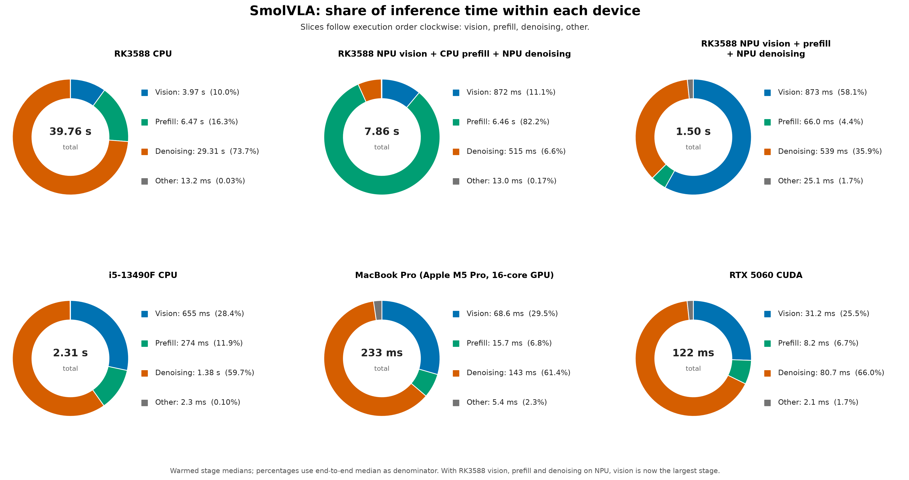

# RK3588 上的 Fast-LeWM 与 SmolVLA

本仓库研究两种不同的端侧机器人推理负载：Fast-LeWM 的 PushT 世界模型与 CEM 规划，以及 SmolVLA 的 LIBERO 视觉语言动作推理。两者的模型、任务和计时口径不同，不能直接用同一个“batch 优化”结论概括。

## 当前结论

### Fast-LeWM：异构规划确实有效，但仍有规划停顿

实现已对齐原论文的终端潜变量代价、预训练权重的注意力分组、最终精英均值选择，以及**一次规划后执行完整 25 个动作**的节奏。RK3588 上的已验证映射是：ViT 与投影走 NPU，动作前缀编码走四个 Cortex-A76 大核，终端 Predictor 与投影走 NPU。固定 300 候选、30 轮 CEM 的完整规划由纯 CPU 的约 **4.47 秒**降至 CPU/NPU 的约 **2.63 秒**；这是每次重规划的等待时间，不是每个动作的闭环延迟。

同一批 50 个 PushT 样本上的后续结果如下。分级候选数保持 30 轮优化，CPU/NPU 协同则在一轮中并行分配候选动作的编码工作。

| RK3588 配置 | 成功样本 | 平均每次重规划 |
|---|---:|---:|
| 纯 CPU，固定 300 候选 | 43/50 | 4504 ms |
| CPU/NPU，固定 300 候选 | 42/50 | 2652 ms |
| CPU/NPU，候选数 `300 → 150 → 64` | 44/50 | 1675 ms |
| 上一项加候选级 CPU/NPU 协同 | **44/50** | **1566 ms** |



动作编码器也曾完整转换到 RKNN，并修复了注意力输出投影的转换误差；但其 batch-300 延迟约 **130 ms**，仍慢于四核 CPU 的约 **67 ms**。因此“不把所有算子都放上 NPU”是实测选择，而非转换失败。分级候选数和协同方案的 50 样本结果不能证明跨任务的成功率不下降。更激进的 iCEM、图形状对齐和动态停止也做过验证：其中基于代价进展的 20/30 轮动态规则在独立 400 样本确认集上未复现早期优势，不能作为当前推荐方案。



**为何早期结论曾认为 NPU 不快？** 旧图把五个未来潜变量都预测出来，却只用最后一个计算 CEM 终端代价；同时预训练权重的注意力头分组没有对齐。修正后，CPU 与 NPU 比较的是同一个终端预测问题。动作编码器曾出现的约 4.9%“异构变慢”也不是可靠的 NPU 干扰结论：服务只绑了四个 A76 核，PyTorch 却建了八个工作线程；改为四线程后，同进程对照差异约 0.17%。

`300 → 150 → 64` 调度保留 30 轮 CEM 更新，把实际候选评估数从 9000 降至 5140，并与现有固定形状 RKNN 图对齐。它改变了搜索预算，不能仅凭动作余弦相似度保证任务质量。完整 NPU 动作编码图虽达到约 `0.999993` 的输出余弦相似度，但 300 候选时仍慢于 CPU；RK3588 自带 Mali GPU 在已测试系统中也没有可用的 OpenCL/Vulkan 计算设备，因此不属于已验证路径。

**已停止的 CEM 调参方向。** iCEM 的 200 样本实验在更低平均延迟下出现少量成功数差异，但没有建立稳健的质量优势。基于预测代价进展决定是否从 20 轮延长到 30 轮的规则，在独立的 600 样本合并验证中是 `512/600`，固定 25 轮是 `514/600`；其平均重规划耗时为 838 对 874 ms，但 P95 反而为 **1045 对 937 ms**。因此不能把这条动态停止规则写成已成立的论文贡献，也不应继续在相同样本上调阈值。相关原始记录保留在 [`results/`](results/)。

### SmolVLA：LIBERO 闭环已跑通，RK 视觉仍是瓶颈

这里使用适配 LIBERO 的 `HuggingFaceVLA/smolvla_libero`，不是下文的 `smolvla_base` 合成输入测试。评测端在每一步生成**完全相同的动作噪声张量**，四种部署都完成了同一 `libero_spatial` 任务 0、初始状态 0、种子 1000 的闭环回合：

| 部署 | 成功所需动作数 | 平均推理耗时/动作 |
|---|---:|---:|
| RTX 主机 CPU | 70 | 4.849 s |
| RTX 5060 CUDA | 69 | **0.238 s** |
| Mac M5 Pro MPS | 70 | 0.509 s |
| RK3588：NPU 主网络 + CPU 辅助 | 68 | 3.236 s |

**推理耗时不含输入预处理、动作后处理和模拟器步进**；远端部署的推理耗时包含请求序列化和网络传输。每种部署只跑了一个完整回合，不能据此比较成功率或精度。原先各设备自行生成噪声时，成功步数为 70–80；对齐噪声后收敛到 68–70，剩余差异尚不能单独归因于精度。



RK3588 把两路图像编码、32 层 Prefill，以及 32 层动作专家与输出投影交给 NPU，但语言/状态/动作嵌入、掩码与 K/V 缓存整理、去噪循环更新仍由 CPU 完成，**不是纯 NPU 部署**。在该闭环回合中，双相机视觉编码约占推理耗时的 **54%**；3.236 s/动作虽能完成模拟任务，尚不足以视为响应式实体机器人控制。图中“其他/传输”是 CPU 辅助、搬运与调度的合计残差，不能全部归为 CPU 算子耗时。完整协议、图转换精度和原始数据见 [LIBERO 闭环评测](docs/smolvla_libero_closed_loop.md)。

LIBERO 模拟器始终运行在 RTX 主机；RK3588 只接收模拟器图像并执行策略推理。base 与 LIBERO checkpoint 的视觉/连接器权重相同，因此 RK 上的两路图像各调用同一张视觉图；两种模型的 Prefill 和动作专家图不同，不能混用。

### 合成输入阶段剖析：不要与 LIBERO 混用

以下三张较早的图使用的是 **`lerobot/smolvla_base`、合成输入、单相机、16 层动作专家**，用于看设备与算子分工；它们**不是 LIBERO 任务成功率或上述 32 层任务模型的耗时图**。该模型的 RK3588 NPU 视觉 + Prefill + 去噪路径约为 **1.503 s/次动作块**，但不应与 LIBERO 闭环的 3.236 s/动作直接比较。详细配置和原始数据见 [SmolVLA RKNN 阶段剖析](docs/smolvla_rknn.md)。

| `smolvla_base` 合成输入路径 | 完整动作块推理中位数 |
|---|---:|
| RK3588 四核 CPU | 39.759 s |
| RK3588：NPU 视觉 + CPU Prefill + NPU 去噪 | 7.856 s |
| RK3588：NPU 视觉 + NPU Prefill + NPU 去噪 | **1.503 s** |
| i5-13490F CPU | 2.309 s |
| Mac M5 Pro MPS | 0.233 s |
| RTX 5060 CUDA | 0.122 s |

907 MB 的 `smolvla_base` 权重可装入 RK3588 的 16 GiB 共享内存，但未优化的纯 CPU 路径远不能用于交互控制。上述数字只检验合成输入的推理与资源使用，不代表 LIBERO 任务能力。







## 下一步研究

最新可视化见 [优化进展柱状图与 C17 解释](docs/SMOLVLA_OPTIMIZATION_PROGRESS.md)：
分别展示完整策略、视觉专项和 C17 局部的逐步变化与分项省时，保留变慢的对照。
“强基线”是当前已测控制，不是理论性能上限；不同实验口径不累计加速。

最新规划见 [从当前发现继续挖机制](docs/NEXT_MECHANISM_PLAN_2026-09-28.md)。
2026-09-29 完整策略重放更新：LIBERO 演示的实际双相机帧接入原十步 FP32
Euler。两轮、三帧、每帧每计划 8 次：整相机并发视觉 + resident action
约 2135-2138 ms，加入 C06 后约 2078-2084 ms，所有测试步骤逐位一致。
同口径剩余视觉约 53%、action 约 34%。C17 的观测驱动局部重放仍省约
1.2 ms/block，但不是完整策略的 10%；暂不全层铺开。三轮各 500 次尾部诊断
把慢尾缩小到 NPU 调用路径，未证明具体根因。真实无损 PNG 每视角 57-66 KiB，
无损 connector 仍约 111 KiB，不能以“特征更小”推动端云切分。详见
[策略重放、尾部与 payload 验证](docs/SMOLVLA_POLICY_REPLAY_VALIDATION.md)。
2026-09-29 续验：原生 head 并行约 11.52 ms，击败初轮 C17 的约 13.62 ms；
后者差异定位到输出投影的权重重索引。最后用 CPU 原生位复制双向接通
原 Q/RoPE、紧凑 group 并行与原输出投影，十次消费约 10.28 ms，比 level-3
head 强对照中位数低 10.3%-10.7%。三轮各 40 次、准备/同步/派发计入；最终独立 512 个合成扰动
逐位一致。但一轮 p95 更差，未接完整 flow。详见
[cross 边界续验](docs/SMOLVLA_CROSS_FOLLOWUP_VALIDATION.md)，
初轮记录保留在 [完整 cross 边界验证](docs/SMOLVLA_CROSS_BOUNDARY_VALIDATION.md)。
判断上区分已有工程基线、实测失败的具体方案、尚未测试的新机制；不因实现
小就自动否定科研价值。当前没有已闭合的 CCF-A 主线，下面是近期验证顺序。

2026-09-28 已补完整 native 十步 flow 强基线：持久绑定 793.24 ms，但普通
native pass-through 794.65 ms 已吸收主要收益，不能包装为新的加速机制。
短 action Attention 搬迁现降为辅助探针。固定条件图内审计现已完成：紧凑与
grouped K/V 路径没有胜过普通 consumer-ready 缓存。后者接完整 32 层、十个
依赖步骤后，两轮各 12 次配对测量为 747.77/749.43 -> 692.65/693.32 ms，
一次 NPU 准备已计入；所有测试步骤的 velocity/FP32 latent 逐位一致。
这是约 7.4% 的 action-flow 工程优化，不是完整 VLA 加速或独立论文主线。
详见 [实际 conditioning 验证](docs/SMOLVLA_CONDITIONING_VALIDATION.md)。同观测
端云无损传输仍是独立的可行域审计，不直接建设调度器。此前结果与
门槛见 [Flow 调查](docs/SMOLVLA_FLOW_INVESTIGATION.md) 和
[最新阅读讨论辨析](docs/VLA_READING_ABSORPTION_2026-09-28.md)。
FC1 分区已降为可选工程项，详见 [最新复审](docs/IDEA_REASSESSMENT_2026-09-28.md)。
下面保留已有视觉与编译机制的证据状态，不表示它们已构成论文主线。

| 优先级 | 方向 | 首个可验证问题 |
|---|---|---|
| P0 / 重放已补 | **真实观测下的强策略基线** | 实际三帧、完整双视角/32 层/十步已接通，剩余视觉约 53%。仅离线重放，闭环、更多任务和隔离内存仍未做。 |
| P1 / C17 / 局部保留 | **原生位桥接，而非强扭矩阵生产者的表示** | 512 合成扰动及 30 个观测驱动步骤逐位通过；观测驱动重放仍比 head 控制快约 10%，每 block 十次只省约 1.2 ms。寻找另一重要同因边界，不直接铺开 32 层。尾部定位到 NPU 调用路径，根因未定。 |
| P2 / C08 / 阶段诊断 | **Attention 内部的异构交接** | 分别核验矩阵计算、稳定归一化与 native 交接的实际赢家；完整 fused/全 NPU 分块控制不能省。没有阶段反转和净收益证据前，不建设 tile runtime。 |
| P3 / C04 / 独立端云候选 | **分工是否改变端侧最优并行维度** | 实际特征比无损 PNG 更大，撤掉省字节默认动机。下一关比较两相机/单本地相机的 branch 服务矩阵，再以实测链路/云服务审查胜区；全云允许流式重叠，不先建调度器。 |

已有视觉机制仍保留：单视角约 31% 收益在公平双视角对照后只剩约 4%-6%，
跨算子交错没有测出互补收益；B2 零 mask 内存修复只改善约 1% 视觉时延。
不继续包装图锁核、原 compact 消费路径或普通持久绑定；C17 改的是此前
独立验证的生产/消费边界，新位复制变体通过局部中位数/已测逐位门槛，但
完整 C17 策略、尾延迟根因与泛化仍未过。三条候选相互独立，不是必选模块或自动替代关系。

当前研究主线固定 **SmolVLA/VLA**，不继续 Fast-LeWM 立题，也不以跳观测、减动作、减去噪步数或近似复用获得收益。详细候选、强基线与判废条件持续维护在 [Idea Candidates](docs/IDEA_CANDIDATES.md)，推导与文献反证见 [路线扩展](docs/IDEA_TASTE_EXPANSION.md)。以上优先级是近期验证顺序，不是已成立的论文贡献；普适性与闭环质量仍需独立任务、设备和热状态下的重复评测。

最新视觉子图实验、数值边界和后续验证门槛见 [视觉机制调查](docs/SMOLVLA_VISION_INVESTIGATION.md)。

## 设备与复现

- [机器交接文档](docs/test_hosts.md)：RK3588、RTX 主机与 Mac 的连接方式、运行环境、模型与 RKNN 图路径，以及相同噪声的完整重跑顺序。
- [模型制品备份清单](docs/artifact_backups.md)：按 Fast-LeWM、SmolVLA base 和 SmolVLA LIBERO 区分已验证图；Mac 与 RTX 主机各存一份板外快照，Git 仅保存 [SHA-256 清单](artifacts/2026-09-24.sha256)与再生成说明。
- [SmolVLA LIBERO 评测脚本](scripts/eval_smolvla_libero.py)：`--matched-noise` 使用评测端的独立 CPU 随机数生成器；[四组闭环原始记录](results/smolvla_libero/)位于 `matched_*_full.json`。
- [Fast-LeWM 原始计时](results/latest_benchmark.json)、[候选级协同任务结果](results/pusht_dataset_board_npu_hybrid_tiered_50.json)和 [研究计划](RESEARCH_PLAN.md)保留了具体实验口径。
- [LIBERO 图表脚本](scripts/plot_smolvla_libero_summary.py)读取上述闭环 JSON；[合成输入图表脚本](scripts/plot_smolvla_stage_comparison.py)读取 `results/smolvla_profile_*.json`。两组图的数据源不能互换。

在已配置的 Mac 环境中重画图：

```sh
PY="$HOME/.cache/fast-lewm-smolvla-venv/bin/python"
MPLBACKEND=Agg "$PY" scripts/plot_smolvla_libero_summary.py
MPLBACKEND=Agg "$PY" scripts/plot_breakdown.py
MPLBACKEND=Agg "$PY" scripts/plot_hardware_icem.py
```

已部署 Fast-LeWM 权重与固定形状 RKNN 图的 RK3588 上，可按下面的命令启动规划服务；导出、转换与评测脚本位于 [`Fast-LeWorldModel/`](Fast-LeWorldModel/) 和仓库根目录。重跑前应先核对图文件、RKNN Runtime 版本及数据集。

```sh
ssh -F ~/.ssh/config_rknn rk3588 \
  'cd /root/Fast-LeWorldModel && taskset -c 4-7 \
   /root/miniconda3/envs/fast-lewm/bin/python -u rk3588_planner_server.py \
   --mode npu --cem-steps 30 --num-samples 300 \
   --candidate-schedule 300x10,150x10,64x10'
```

所有任务成功数均限于所写明的数据集与回合数，模拟器成功不能代替实机时延与安全性验证。
