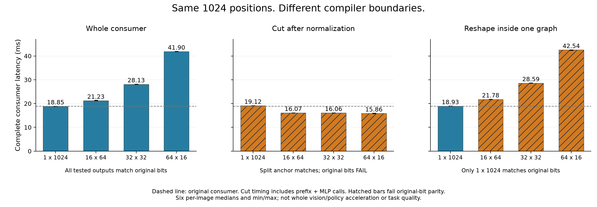

# SmolVLA 实际视觉服务与阶段几何：执行报告

2026-09-30。执行依据：[高优任务计划书](PLAN_VISION_BOUNDARIES_2026-09-30.md)。
结论：实际视觉服务矩阵已完成；发现了**同一 token 几何在不同编译边界下由慢变快**的线索，
但更快的拆图路径未保持原 consumer 的逐位输出，不能计为无损完整策略优化或已成立主线。
项目顺序更新：先完整服务/端云可行域，阶段几何降为限时支撑；见
[主线计划与自审](MAINLINE_EXECUTION_PLAN_2026-09-30.md)。本报告测量结论不变。

## 1. 本轮回答了什么

| 问题 | 实验回答 | 决策 |
|---|---|---|
| 单视角 head 并行收益在实际图像上还成立吗？ | 成立：约 32.4%–32.8%；但双视角相对整相机并发只剩约 6.2%–6.3% | 保留强控制，停止外推单分支百分比 |
| 相机数变化后，最佳配置已经发生切换吗？ | 未证明。已测 head 路径在单、双分支都更快，仅相对优势变化 | 不能用“赢家反转已确认”支撑端云调度器 |
| 视觉 consumer 有动作边界那样昂贵的排列恢复吗？ | 原实际末层 profile 没有发现这种大恢复算子；主要时间仍在 FC1/FC2 | 不把动作位桥接的动机直接搬过来 |
| 只改变独立 token 的二维表示会怎样？ | 整段改写变慢；切在归一化后、只改 MLP 则更快 | 执行几何和编译传播边界不能分开看 |
| 不拆图、只在归一化后插 reshape 能替代吗？ | 不能：编译器把 reshape 移到归一化之前，重新出现短批次 MLP | 简单单图控制已测，不只是与原表示比较 |
| 更快路径是否已经可部署？ | 否。与拆图 flat anchor 一致，但与原 consumer 不一致；末端 ConvAdd 退融合是数值线索 | 先定位/保持原数值协议，不铺十二层、不报策略收益 |

## 2. 实际单/双相机服务矩阵

输入为固定 revision 的 LIBERO-Spatial episode 11 三帧（0/42/83）、两个真实记录视角，
共六张图。单相机是分支服务测量，不是删掉策略一路输入。保持 512×512 预处理、
1024 tokens、12 heads、12 层及 connector，不训练、不改目标精度配置。

两次独立进程会话，每帧每方案每模式 8 次轮换。`input_compute_output` 包含输入原生
FP16 打包、同步、完整视觉计算及 connector FP32 读回，不含外部图像 resize/normalize、
图加载、核配置切换与后续策略。核配置在计时前设定，不提供动态切换开销结论。
同时保留独立的驻留计算口径；不以两者中位数差严格推出 I/O 耗时。

下表为六个“会话 × 帧”中位数的范围，两个单相机分别计量，未混池原始样本：

| 完整视觉方案 | 相机数 | 含输入/读回中位数范围 |
|---|---:|---:|
| 融合图，单相机 mask7 | 1 | 766.43–768.27 ms |
| 原生分图，4+4+4 heads 并行 | 1 | 516.03–518.65 ms |
| 融合整相机并发，mask1 / mask2 | 2 | 1102.94–1105.20 ms |
| head 并行，两相机串行 | 2 | 1033.63–1035.12 ms |
| head 并行，两相机再并发 | 2 | 1024.07–1027.68 ms |

head 串行双相机相对融合整相机并发，中位数降幅 **6.17%–6.35%**，每组均 8/8 配对更快。
再叠相机并发相对 head 串行只降 **0.72%–0.93%**。这不是稳定尾延迟、成功率或完整策略收益。
所有十二层 head/full anchor、相机交换/恢复、测量后输出检查通过；但分图相对融合
connector MAE **0.01376–0.01817**、最大差至 **0.3125**，质量门槛仍开放。

NPU/DRAM 在正式阶段 50 ms 采样中分别只观察到 1 GHz / 2.112 GHz，最高采样温度
47.153°C。快照不能排除短暂变化，driver busy 不能替代 MAC 利用率。
两套方案的 context 共驻，不能从此报告隔离部署 peak RSS 或能耗。

数据：[第一会话](../results/smolvla_libero/vision_service_matrix/session1.json)、
[第二会话](../results/smolvla_libero/vision_service_matrix/session2.json)、
[逐输入配对分析及 telemetry 摘要](../results/smolvla_libero/vision_service_matrix/paired_analysis.json)。

## 3. 原始边界诊断：没有先假定同因瓶颈

另外三次插桩测量中，十二层累计 consumer（输出投影、残差、归一化与 MLP）约
226.88–227.85 ms；head Attention 约 217–219 ms。阶段诊断不加入正式样本，
也不相加各阶段中位数构造完整时延。

frame 0 / camera 0 的实际末层 consumer SDK profile：

| 算子 | SDK 时间 | SDK workload |
|---|---:|---|
| Attention 输出投影 | 912 µs | 三核 |
| 第一处残差 Add | 186 µs | 三核 |
| LayerNorm | 1379 µs | 核 0 |
| FC1 + GELU | 7259 µs | 核 0 |
| FC2 + 残差，ConvAdd 融合 | 9060 µs | 三核 |

原图并没有动作边界那种显著的恢复矩阵/转置；不能以“consumer 占比高”直接证明布局搬运
是问题。这也不证明 FC1 单核就是编译器缺陷，更不构成完整 Roofline 分类。

逐层数值辅助诊断中，融合 audit connector 与融合单输出控制在该图像上逐位一致，
分图差异从第一层就出现。**增加中间输出可能改变内部融合**，最终一致不能证明原图
所有内部算子都未变；因此这些层差异是定位线索，不是原融合执行的无扰动轨迹。

数据：[末层原生接口、数值与 profile 审计](../results/smolvla_libero/vision_service_matrix/frame0_camera0_boundary.json)，
[consumer profile](../results/smolvla_libero/vision_service_matrix/frame0_camera0_boundary.consumer.perf.txt)。

## 4. 新矛盾：对 MLP 有利的形状，被上游编译传播破坏

**这里的 16×64 / 32×32 / 64×16 不是相机分辨率。** 它们都是同样 1024 个 token 在
NPU 输入表示中的索引分解。MLP 对每个 token 独立计算，归一化仍沿同样 768 通道；
既没有减少位置，也没有改变视觉邻接/Attention。原有参数保持，native C8 存储可直接
以 FD 视图重解释，不靠 host 重新排列整张特征图。

先做整段 consumer 的等价改写：同一实际末层输入、六张图，每方案 40 次轮换。
原图重编译是额外控制；FP32 单个固定随机 reference 已测逐位一致，实际 NPU 的整段
二维方案也全部与原 consumer 逐位一致。结果却变慢：

| 方案 | 第一轮六张图的中位数范围 | 相对原 consumer 数值 |
|---|---:|---|
| 原 consumer | 18.901–18.946 ms | anchor |
| 原图重编译 | 18.845–18.939 ms | 逐位一致 |
| 整段 1×1024 表示 | 18.887–18.972 ms | 逐位一致 |
| 整段 16×64 | 21.228–21.441 ms | 逐位一致 |
| 整段 32×32 | 28.056–28.121 ms | 逐位一致 |
| 整段 64×16 | 41.892–41.944 ms | 逐位一致 |

32×32 profile 显示，归一化前插入 `(1,768,32,32) → (32,768,1,32)` 转置，
FC1 因而处理 **B=32 的短条**，不是 **B=1 的二维块**。FC1 SDK 时间约
7.26 → 14.88 ms；新转置合计约 0.626 ms，不足以单独解释整段退化。
这不是“搬运稍微多了一点”，而是下游执行几何被改变了。

### 4.1 反事实：在归一化后建立真实编译边界

保持投影/残差/归一化为原 flat 几何，单独导出 MLP；新增一次图调用全部计费，
prefix 输出直接作为 MLP native FD 输入。六张图、40 次轮换：

| prefix + MLP 完整段 | 中位数范围 | 原 consumer / flat split 数值 |
|---|---:|---|
| flat MLP | 19.052–19.093 ms | 原图不同 / split anchor |
| MLP 16×64 | 16.086–16.130 ms | 原图不同 / split anchor 逐位一致 |
| MLP 32×32 | 16.067–16.127 ms | 原图不同 / split anchor 逐位一致 |
| MLP 64×16 | 15.836–15.905 ms | 原图不同 / split anchor 逐位一致 |

64×16 比原完整 consumer 降约 **16.0%–16.4%**，但这只是**数值尚未合法化的候选**。
独立进程追加单图控制时再次观察到 15.820–15.950 ms；该轮有 15 个方案而前轮有 11 个，
不将二者混池为相同日程的统计重复。每个日程内仍各自配对比较。

MLP 64×16 维持 B=1 / H=64 / W=16；FC1 SDK 时间约 7.28 → 6.99 ms，
FC2 约 8.99 → 5.94 ms，实际矩阵阶段有改善。SDK MAC/workload/RW 字段不是实测
硬件占用或 DDR 流量。prefix 导出的残差输出分配空间是 3 MiB 而有效 C8 payload
为 1.5 MiB；程序在计时前后逐位核对 native 解码与 SDK 逻辑读回，不能仅凭相同 dims
就假定稠密，也没有搬运这个冗余空间来伪造收益。

**数值差异没有被忽略。** 所有已测 split 几何与 flat split 输出逐位一致；但 split
与原 consumer MAE 约 0.000262–0.000343、最大差 0.5。原图末端为 ConvAdd，
split 为 Conv + Add，编译融合与舍入改变是一个明确线索。尚未通过中间量/融合保持
对照证明唯一原因，不能认定“拆归一化必然导致误差”，更不能认为 MAE 小就无损。

### 4.2 更简单的控制：在一个图内只 reshape MLP

不增加 graph I/O，只在 LayerNorm 后、FC1 前插等价 reshape，在 FC2 后还原。
FP32 固定 reference 通过。实际六张图、40 次轮换：

- 1×1024 控制约 18.912–19.002 ms，已测逐位一致。
- 16×64 约 21.708–21.808 ms；32×32 约 28.544–28.662 ms；64×16 约
  42.423–42.541 ms。后三者还存在与原图的数值差异。
- Profile 中 `__stage_norm_to_spatial` **执行在 exNorm 之前**，后续变为 B=H。
  因此 ONNX 中把 reshape 写在 Norm 后，并未保证编译后在那里执行。

该控制支持“跨阶段布局传播妨碍局部几何”的解释，但没有定位 RKNN 的具体编译 pass，
也没有证明所有后端/形状都有这种问题。无净收益的整段改写、简单单图 reshape 到此停止。

图取追加单图控制的独立会话：每柱为六个逐图中位数的中位数，误差线为这六个中位数的
最小/最大值，不是置信区间；斜线明确标出原图逐位门槛失败。不是十二层/整策略加速图。

数据：[整段几何](../results/smolvla_libero/vision_service_matrix/spatial_analysis.json)、
[归一化后拆图](../results/smolvla_libero/vision_service_matrix/split_spatial_analysis.json)、
[追加单图控制](../results/smolvla_libero/vision_service_matrix/stage_spatial_analysis.json)。
三套原始 session、profile 与导出 manifest 位于同一结果目录；原始 telemetry 留在
本机 cache/板端，摘要保留 SHA-256、频率和温度。后两轮最高采样温度分别 44.384°C、45.307°C。

## 5. 降级后的局部续验：保持融合数值的阶段几何

本节不再是项目最高优先级；先按主线完成 P0/P1。数值归因初轮最多 1–2 个
工作日，不能因局部变快就扩十二层或建设 runtime。

| 动机 | 目的与最小操作 | 预期成果 | 风险 / 停止条件 |
|---|---|---|---|
| 相同二维几何在整段慢、真实边界后快；直接单图 reshape 无效 | 核对 Norm/残差/FC2 中间量，对照 ConvAdd 与 Conv + Add；验证是否能保留原融合舍入及 B=1 二维 MLP | 数值差异归因、可实现接口和完整 consumer 配对结果，不预先承诺加速 | 若必须放宽原数值协议才得到收益，则暂停部署候选；不以新增精度降级或阈值绕过 |
| 末层局部收益可能不足以立题 | 仅在上述 gate 通过且主线完整时间线证明必要后，才考虑代表层、十二层和实际双视角 | 完整关键路径收益、不同边界/形状适用范围 | 不自动扩层、不乘十二、不加旧独立收益；被强控制吸收则停止该版本 |
| 视觉分图本身尚与融合不同 | 原 head 路径与候选均接相同十步依赖策略，固定噪声审计动作轨迹，再补闭环 | 单独的完整策略数值/质量判断 | 不把局部 anchor 位一致当闭环质量；无需为局部现象先建 runtime |

现阶段的潜在 insight 是：**数学上可交换的表示调整，编译器替我们交换后却可能锁住
下一阶段不合适的执行几何；运行时边界能保住几何，却又暴露调用和融合舍入成本。**
这是值得继续的局部矛盾，不是已经证明的新范式。还欠原数值保持、全视觉重要性和
已有编译/布局工作的差异化对照；不能因同时提到 VLA 与 NPU 就跳过这三道门槛。

端云主机本轮已恢复访问并确认现有 checkpoint/环境，未运行新的云端时延或闭环评测。
完整服务/网络胜区已升为当前工作主线的前置门槛，不是这个边界失败后的
自动备用故事；这个局部现象只有在完整路径上重要才继续集成。

## 6. 复现入口

- 实际服务：`probe_smolvla_vision_service_matrix.cpp`、`run_smolvla_vision_service_matrix.py`、
  `analyze_smolvla_vision_service_matrix.py`。
- 实际边界：`probe_smolvla_vision_boundary_profile.cpp`。
- 三种几何导出：`export_smolvla_spatial_consumer.py`、
  `export_smolvla_split_spatial_consumer.py`、`export_smolvla_stage_spatial_consumer.py`。
- 相同 native 测量入口：`probe_smolvla_spatial_consumer.cpp`、
  `run_smolvla_spatial_consumer.py`（可选 `--split-dir` / `--stage-dir`），
  `analyze_smolvla_spatial_consumer.py`；画图：`plot_smolvla_visual_geometry.py`。

编译沿用 toolkit 2.3.2、优化 level 0、FP16、不量化；原图重编译控制不变。
镜像、运行脚本/二进制、模型与实际输入 SHA 见 session。ONNX ReferenceEvaluator 的
底层 NumPy matmul 发出了浮点告警，最终 reference/candidate 均检查有限值并已测位一致；
这仍只是一个固定随机输入的检查，不替代图结构证明、实际 NPU 或任务质量测试。
RKNN 运行使用 2.3.2 native API 库、A76 affinity 4–7；转换与板端正式计时未并发。
大型模型、图像和 connector 不进 Git；临时开启的本机转换 VM 已恢复停止。

验证：九项配对分析/图变换单元测试通过；三个 C++ 探针在板端以
`-Wall -Wextra` 编译通过；五套 session 均完成，链接与 JSON 审计通过。
生成 profile/SVG 仅统一行尾空白，重算分析一致；这不是候选原数值 gate 通过。
